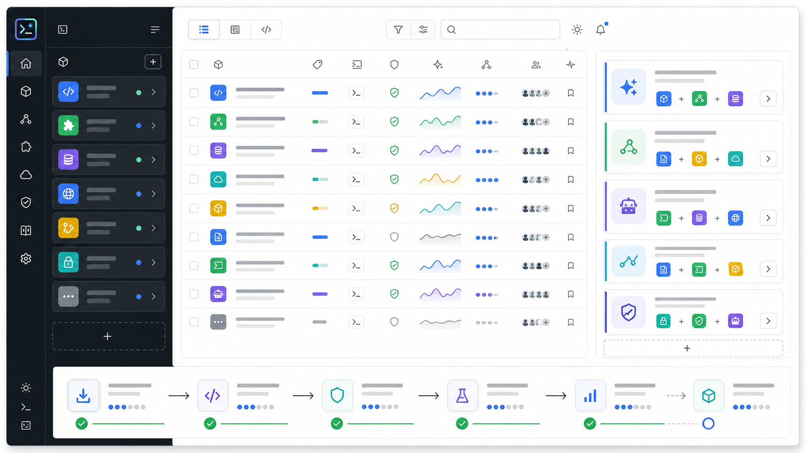
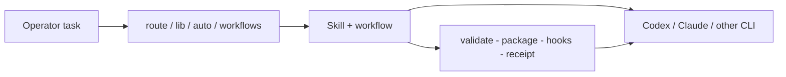

[](https://github.com/Tlkh201313/SkillsForge/actions/workflows/ci.yml)


[](LICENSE)

**SkillsForge is the Work OS that makes Agent Skills productive** - route the right skill, run the right workflow, keep a local library, and ship across AI CLIs. Trust (validate -> package -> hooks -> receipts) is built in so you can run that catalog safely.

Current inventory: **511** skills - **28** packs - **11** profiles - **100** workflows - **98** agents - **136** command shims.



The preview is an illustrative product visual with no embedded text claims. Source-backed counts, commands, and trust boundaries are listed below.

---

## What judges should understand in 30 seconds

| You want... | SkillsForge gives you... |
|---|---|
| Less flailing in Codex / Claude / Cursor | Packs, profiles, roles, and `auto` / `lib recommend` routing |
| Reusable playbooks | **100** dry-run workflows + workbench (`wb`) + PowerShell `sf-*` helpers |
| One install story across hosts | `hosts` + `install` with honest fidelity labels |
| Confidence the skill isn't a random blob | Sidecars, validate/package, PreToolUse where supported, receipts |

Full surface map: **[docs/features.md](docs/features.md)**.

---

## Demo video


Browser preview: **[docs/demo-video.html](docs/demo-video.html)**.

Packaged MP4: [`assets/video/skillsforge-demo.mp4`](assets/video/skillsforge-demo.mp4). The committed cut is 2:22, H.264/AAC, with English voiceover, original procedural background music, light UI sound effects, and burned-in captions. GitHub README playback for committed MP4s is unreliable, so the poster stays visible. For judging, upload the same MP4 to YouTube as public/unlisted and paste the URL into Devpost.

| Beat | What you'll see |
|---|---|
| Thesis | Vibe coding needs a development plugin layer: skills, commands, workflows, indexes, routing |
| AI use | Codex accelerated implementation/video/verification; GPT-5.6 helped reason through claims and review quality |
| Scale | 511 skills / 28 packs / 11 profiles / 100 workflows / 98 agents / 136 command shims |
| Operator path | `vibe` -> `catalog` / `lib` -> `route` / `workflows` -> `map` / `slim` / `digest` |
| Safety layer | Validation, packaging, receipts, and guardrails sit underneath the productivity surface |
| CTA | Free local test: `node plugins/skillsforge/bin/skillsforge.mjs vibe` |

---

## System maps


These maps are committed static assets. They show package-fidelity host boundaries, current inventory, local library outputs, and the trust gates without relying on generated numbers.

---

## Why SkillsForge

Most skill dumps optimize for **count**. Operators need **throughput**: which skill fits this task, which workflow to dry-run, how to keep a local library warm, and how to install across hosts without lying about trust.

SkillsForge is that layer:

1. **Catalog + profiles** - 28 packs / 11 profiles spanning builder, validation, methodology, eng, design, product, ops, security, and more
2. **Route & recommend** - `route`, `lib recommend`, `workflows recommend`, `auto plan|run --read-only` (returns `no confident match` instead of forcing weak hits)
3. **Operator terminals** - `wb`, `os-*`, `ps export` -> `sf-*.ps1`
4. **Ship across hosts** - Codex + Claude Code runtime where supported; package-fidelity elsewhere
5. **Safety underneath** - `skillsforge.json` sidecars, validate/package, PreToolUse guards, unsigned receipts


## Codex + GPT-5.6 collaboration

This Build Week work used Codex and GPT-5.6 as implementation and review accelerators. Codex helped navigate the repository, produce the demo video, generate audio assets, update docs, and run verification commands. GPT-5.6 helped reason through product claims, edge cases, timing, and review quality.

Human decisions stayed human: product scope, claim boundaries, what not to overstate, and what evidence was strong enough for submission. The video says this explicitly.



---

## Why this idea (vs ECC, Superpowers, gstack)

| Project | What it's great at | What SkillsForge adds |
|---|---|---|
| **ECC-class packs** | Surface completeness | A **Work OS** (library, workflows, auto, wb) **plus** a trust pipeline - not another dump |
| **Superpowers** | Discipline / TDD iron laws | Those laws as skills **plus** routing, operator CLI, and capability policy |
| **gstack** | Role lenses, ship/QA workflows | Portable packages with sidecars; we do **not** clone browse daemons |

Honest differentiation: [docs/competitive-matrix.md](docs/competitive-matrix.md), [docs/inspiration.md](docs/inspiration.md).

| Dimension | Local evidence |
|---|---|
| Core pitch | Productivity Work OS for Agent Skills |
| Catalog | 511/511 skills ship `skillsforge.json`; design pack has 60 skills |
| Operator CLI | `vibe`, `lib`, `workflows`, `auto`, `wb`, `ps`, `demo` |
| Safety layer | validate -> package -> PreToolUse -> receipt |
| SkillShield | Best-effort skill-body scanner |
| MCP | Thin: validate, route, skillshield, read-only library/workflow tools |

---

## Magical moment (&lt;90s)

```sh
git clone https://github.com/Tlkh201313/SkillsForge.git
cd SkillsForge
npm ci
npm run build
npm link
sf init --profile vibecoder --session-host codex --json
sf lib recommend --query "build an MCP plugin and validate the launch path" --json
sf workflows run --id agentic.skill-routing-plan --dry-run --json
sf session score --json
```

You should see: project config, local library HTML, AI index, compact session memory, a minimum skill/workflow recommendation, and a dry-run workflow checklist. The generated AI index lives at `artifacts/skillsforge-library/skillsforge-ai-index.html`.

Optional follow-ups:

```sh
sf vibe
sf lib open
sf lib select --skill build-mcp-server
sf lib recommend --query "safe refactor" --session-host codex
sf workflows recommend --query "ship a release"
sf auto run --read-only --query "audit README claims"
sf session remember --query "safe refactor" --skill eng-safe-codegen --workflow coding.safe-refactor --outcome "tests passed"
sf demo  # trust-layer beat: unsafe deny -> safe package -> scoreboard
sf compare-skill --a examples/codex-unsafe-release --b examples/codex-safe-release
```

Timed script: [docs/hackathon-demo.md](docs/hackathon-demo.md). Roadmap: [docs/roadmap-next.md](docs/roadmap-next.md).

> **Not on npm yet.** Do not use `npx skillsforge` - use `npm link` from this clone, or the long repo binary path.

---

## What you get today

| Surface | Actual implementation |
|---|---|
| One plugin | `skillsforge` (Claude + Codex manifests) |
| Productivity catalog | **511** skills, **28** packs, **11** profiles |
| Workflows | **100** dry-run definitions under `plugins/skillsforge/workflows/` |
| Agents / commands | **98** agents - **136** command shims |
| Project OS | `init`, `settings`, `session` - config, compact usage memory, AI-facing links |
| Library | `lib build|update|serve|recommend|select|unselect|selected|open` - local HTML + AI index + project selection |
| Auto router | `auto plan`, `auto run --read-only` |
| Workbench | `wb status|tree|find|grep|diff|errors|bigfiles|recent|proof` |
| PowerShell | `ps export` -> `sf-*.ps1` wrappers |
| Trust demo | `demo` - unsafe deny -> safe package -> scoreboard |
| Sidecars | **100%** (`skillsforge.json` beside every production skill) |
| Depth honesty | Structured heroes + contract-backed domain skills |
| Universal hosts | `hosts`, `install --hosts all|detected`, `--custom-host` |
| Thin MCP | Trust tools + read-only recommend/settings/quality/contract tools |

### Host support

| Host | Status | What that means |
|---|---|---|
| Codex CLI | **Native plugin + guarded package** | Marketplace + `package --host codex` -> PreToolUse hooks |
| Claude Code | Full | Marketplace, SessionStart, skill-scoped PreToolUse, receipts |
| Cursor / OpenCode / ZCode / Hermes / Gemini | Package fidelity | Complete skill dirs - **not** runtime policy parity |
| Custom AI CLI | Package fidelity | `install --custom-host <id>:<skills-dir>` under `--home` |

---

## Install

### Codex (native plugin)

**POSIX**

```sh
codex plugin marketplace add "$(pwd)"
codex plugin list --json
codex plugin add skillsforge@skillsforge-marketplace
```

**Windows (PowerShell)**

```powershell
codex plugin marketplace add (Get-Location).Path
codex plugin list --json
codex plugin add skillsforge@skillsforge-marketplace
```

Marketplace: [`.agents/plugins/marketplace.json`](.agents/plugins/marketplace.json) -> `plugins/skillsforge`.

Codex **runtime** policy for an external skill requires `skillsforge package --host codex`, not `install` alone.

### Claude Code

```text
/plugin marketplace add Tlkh201313/SkillsForge
/plugin install skillsforge@skillsforge-marketplace
```

```text
/skillsforge:validate path/to/skill
/skillsforge:route how do I validate a skill package
/skillsforge:doctor
```

### Multi-host skill install

```sh
node ./plugins/skillsforge/bin/skillsforge.mjs hosts
node ./plugins/skillsforge/bin/skillsforge.mjs install --hosts codex,claude-code --yes --dry-run plugins/skillsforge/skills/using-skillsforge
node ./plugins/skillsforge/bin/skillsforge.mjs wb status --json
node ./plugins/skillsforge/bin/skillsforge.mjs workflows recommend --query "safe refactor code"
node ./plugins/skillsforge/bin/skillsforge.mjs auto run --read-only --query "audit README claims"
node ./plugins/skillsforge/bin/skillsforge.mjs lib update --session-host codex
node ./plugins/skillsforge/bin/skillsforge.mjs ps export
```

Known host ids: `claude-code`, `cursor`, `codex`, `opencode`, `zcode`, `hermes`, `gemini`. Details: [docs/universal-hosts.md](docs/universal-hosts.md).

---

## Core CLI

Requires Node.js >= 20. After install you can type **`skillsforge`** or short **`sf`** - you do not need the long `node .../skillsforge.mjs` path every time.

```sh
npm ci
npm run build
npm link          # once per machine: puts `skillsforge` and `sf` on your PATH
skillsforge help
sf init --profile vibecoder --session-host codex
```

```powershell
npm ci
npm run build
npm link
# If `sf` / `skillsforge` are not found, npm's global bin is missing from PATH:
#   $env:Path += ";$env:APPDATA\npm"
# Or permanently: add %AppData%\npm under Environment Variables -> Path
skillsforge help
sf init --profile vibecoder --session-host codex
# optional: also export repo-local helpers
skillsforge ps export
# then add artifacts/powershell to PATH, or dot-source:
# . .\artifacts\powershell\sf.ps1
```

Without `npm link`, the long form still works (judge/CI path):

```sh
node plugins/skillsforge/bin/skillsforge.mjs demo
```

> **Not on npm yet.** Do not use `npx skillsforge` from the public registry. Use `npm link` from this clone (or the long `node` path).

Exit codes: `0` success - `1` failure - `2` invalid usage.

### Productivity first

| Command | Purpose |
|---|---|
| `vibe` / `catalog` / `quality` | Magical moment, pack browse, quality score |
| `init` | Create project config, library artifacts, AI index, and compact session memory |
| `route --query <text>` | Explainable skill routing |
| `lib` | Build/update/serve/recommend local skill library |
| `workflows` | List, show, recommend, or dry-run workflows |
| `auto` | Recommend smallest matching skill + workflow (read-only) |
| `settings` | Show, validate, set, or reset local SkillsForge config |
| `session` | Remember/recall/score/export compact skill/workflow usage, not chat transcripts |
| `tokens` | Estimate context tokens (catalog / skill / path); default catalog = repo skills (`--installed` for host); optional `--track` session. Heuristic chars/4 - not API billing. |
| `digest` | One-shot briefing: status + recommend + token cost + next commands |
| `next` | Suggest next productive commands from repo state |
| `map` | ForgeMap: lean JS/TS structural index (`status`/`index`/`symbol`/`callers`/`impact`/`explore`); optional enrich from `.codegraph/codegraph.db` |
| `slim` | ForgeSlim: compress git/test/rg command output; `slim gain` shows estimated tokens saved |
| `wb` | Token-friendly repo status, search, diff, proof |
| `ps export` | Generate PowerShell `sf-*.ps1` helpers |
| `os-*` | Cross-platform OS helpers (`os-run` dry-run unless `--yes`) |

### Trust & ship

| Command | Purpose |
|---|---|
| `demo` | Trust-layer proof: unsafe deny -> safe package -> scoreboard |
| `hosts` / `install` | Host inventory + multi-host install |
| `validate` / `doctor` | Structure + capability policy |
| `package --host codex` | One skill -> guarded Codex plugin |
| `receipt` / `verify-receipt` | Tamper-evident package receipt |
| `evidence` | Deterministic trust/eval bundle |
| `enforce` | PreToolUse allow/deny from stdin |
| `skillshield` / `pressure` | Body scan / fixture pressure gate |
| `compare-skill` | Side-by-side trust delta |
| `forge` / `scaffold` | Deterministic skill generation |
| `eval` | Holdout routing evaluation |

Expected PowerShell helpers: `sf` (full CLI passthrough), `sf-status`, `sf-tree`, `sf-find`, `sf-grep`, `sf-diff`, `sf-errors`, `sf-bigfiles`, `sf-recent`, `sf-ports`, `sf-proof`, `sf-lib`, `sf-lib-update`, `sf-recommend`, `sf-workflow`, `sf-auto`, `sf-tokens`, `sf-digest`, `sf-next`, `sf-map`, `sf-slim`, `sf-slim-gain`.

See also [docs/forgemap-slim.md](docs/forgemap-slim.md) for ForgeMap / ForgeSlim limits.

### Demo examples

| Example | Intent |
|---|---|
| [`examples/codex-unsafe-release/`](examples/codex-unsafe-release/) | Undeclared exec + network - **FAIL** validate / package |
| [`examples/codex-safe-release/`](examples/codex-safe-release/) | Least-privilege - **PASS** validate / package |
| [`examples/safe-dependency-upgrade/`](examples/safe-dependency-upgrade/) | Forge-spec dry-run fixture |

---

## Claim boundaries / security

### Anti-goals (not claimed)

No Ruflo swarms, AgentDB, consensus, OS sandboxing, or third-party attestation. Library UI is local, not a cloud dashboard. Domain packs are contract-backed SkillsForge skills, not copied dumps from skills.sh.

### Say aloud

- **Productivity first; trust is the safety layer.**
- **Hook guardrail != OS sandbox.**
- **Static checks are best-effort.** SkillShield scans skill bodies only.
- **Demo scoreboard != full trust receipt.** Use `receipt` / `evidence` for real receipts.
- **Receipts are unsigned tamper evidence.**
- **Honest depth:** structured heroes + contract-backed domain skills; eight auto-route heroes.
- **Codex does not intercept every tool path;** invalid hook output can fail open at the host.

Threat model: [docs/threat-model.md](docs/threat-model.md).

---

## Verification

```sh
npm ci
npm run check
```

### Docs map

| Doc | Use |
|---|---|
| **[docs/features.md](docs/features.md)** | Full inventory: skills, workflows, agents, commands |
| [docs/architecture.md](docs/architecture.md) | Surfaces, Codex compile, hook flow |
| [docs/universal-hosts.md](docs/universal-hosts.md) | Host modes and policy boundaries |
| [docs/threat-model.md](docs/threat-model.md) | Trust boundaries |
| [docs/hackathon-demo.md](docs/hackathon-demo.md) | Timed judge script |
| [docs/competitive-matrix.md](docs/competitive-matrix.md) | Claim boundaries |
| [docs/submit-checklist.md](docs/submit-checklist.md) | Human submit gates |
| [docs/roadmap-next.md](docs/roadmap-next.md) | Post-0.4.2 priorities |

---

## License

[MIT](LICENSE) (c) 2026 Tlkh201313.
