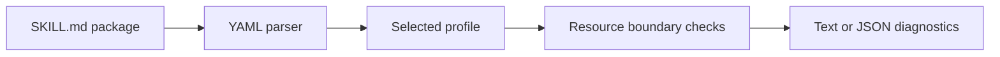
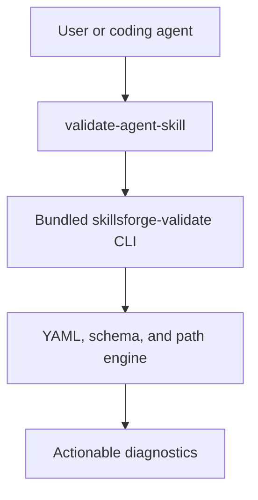

[](https://github.com/Tlkh201313/SkillsForge/actions/workflows/ci.yml)


[](LICENSE)

SkillsForge is a multi-plugin marketplace for portable Agent Skills. Version 0.3.0 ships one production plugin: a capability engine that validates, forges, routes, policy-scans, and packages [Agent Skills](https://agentskills.io/specification) with evidence receipts for Claude Code.

## Host support matrix

| Host | Status | What that means |
|---|---|---|
| Claude Code | Full | Marketplace install, SessionStart, skill-scoped PreToolUse hooks, bundled `skillsforge` CLI |
| Cursor | Proof | Deterministic `SKILL.md` export plus lossiness report — not runtime policy parity |
| Codex | Unsupported | Not packaged or claimed |
| OpenCode | Unsupported | Not packaged or claimed |

## What ships today

| Surface | Actual implementation |
|---|---|
| Claude Code skills | `validate-agent-skill`, `author-capability`, `route-capability`, `verify-capability`, `using-skillsforge` |
| Runtime CLI | `skillsforge` / `skillsforge-validate` bundled for marketplace installs |
| Canonical sidecar | `skillsforge.json` (routing, capabilities, compatibility) validated with Ajv |
| Forge | Deterministic skill generation from forge-spec (`--dry-run` / `--write`) |
| Routing | Explainable scores with holdout evaluation gate |
| Policy | Static scan + skill-scoped PreToolUse enforce (guardrails, not a sandbox) |
| Receipts | Reproducible full-package hashes + Cursor lossiness proof |
| Diagnostics | Human-readable and JSON output with non-zero failure exits |

Planned marketplace plugins beyond `skillsforge` are listed separately and are not presented as available.

## Validation pipeline



The parser accepts valid BOM, CRLF, comments, quoted values, and multiline YAML. Profile validation uses Draft 2020-12 JSON Schema. Resource checks reject missing files, unsupported URI schemes, sibling-prefix escapes, and links whose real path leaves the skill directory.

## Plugin availability

| Plugin | Purpose | Version 0.3.0 | Install command |
|---|---|:---:|---|
| `skillsforge` | Forge, validate, route, policy-enforce, and package skills | Available | `/plugin install skillsforge@skillsforge-marketplace` |
| `skill-author` | Guided skill authoring (host UX) | Planned | — |
| `skill-reviewer` | Qualitative skill review | Planned | — |
| `skill-sync` | Cross-environment synchronization | Planned | — |
| `skill-adapters` | Additional host adapters | Planned | — |
| `skill-orchestrator` | Multi-skill orchestration | Planned | — |

Only `skillsforge` is installable in this release. See [docs/architecture.md](docs/architecture.md), [docs/threat-model.md](docs/threat-model.md), and [docs/hackathon-demo.md](docs/hackathon-demo.md).

## Install in Claude Code

```text
/plugin marketplace add Tlkh201313/SkillsForge
/plugin install skillsforge@skillsforge-marketplace
```

Invoke the installed skill with a path:

```text
/skillsforge:validate-agent-skill path/to/skill
```

Claude Code loads the skill, runs the bundled command, and reports structural failures before qualitative advice.

## Use the validator directly

```sh
npm ci
npm run build

# Portable Agent Skills specification
./plugins/skillsforge/bin/skillsforge-validate path/to/skill

# Portable fields plus supported Claude Code extensions
./plugins/skillsforge/bin/skillsforge-validate --profile claude-code path/to/skill

# Machine-readable diagnostics
./plugins/skillsforge/bin/skillsforge-validate --json path/to/skill

# Every production skill under plugins/*/skills
./plugins/skillsforge/bin/skillsforge-validate --all
```

On Windows PowerShell, use Node explicitly:

```powershell
node .\plugins\skillsforge\bin\skillsforge-validate path\to\skill
```

## Profiles

| Capability | `canonical` | `claude-code` |
|---|:---:|:---:|
| Agent Skills core fields | ✓ | ✓ |
| `metadata` string map | ✓ | ✓ |
| Portable `allowed-tools` string | ✓ | ✓ |
| Claude tool arrays | — | ✓ |
| Invocation controls | — | ✓ |
| Claude model, context, agent, and hooks | — | ✓ |
| Unknown top-level fields | Rejected | Rejected |

Put portable project-specific values under `metadata`. Select `claude-code` only when the package intentionally uses Claude extensions.

## Runtime architecture



The committed CLI bundle contains its runtime dependencies, so a marketplace installation does not run `npm install`. Source and bundle drift is blocked by `npm run build:check`.

## Example output

Successful package:

```text
PASS validate-agent-skill (canonical)
```

Invalid package:

```text
FAIL example-skill
  - frontmatter / must contain description
  - relative markdown link must resolve: references/missing.md
```

Exit codes are `0` for success, `1` for validation failure, and `2` for invalid CLI usage.

## Verification

Run the same release-contract dry run locally from the repository root:

```sh
npm ci
npm run check
```

`npm run check` includes validate, test, eval, demo, build, `build:dist`, `smoke:dist`, and hard `validate:host` (`claude plugin validate --strict` via local `@anthropic-ai/claude-code`; no soft-skip).

GitHub Actions runs the unit matrix on Ubuntu, Windows, and macOS with Node.js 20 and 22. The release-contract job (Ubuntu) runs the full gate including demo, `build:dist`, `smoke:dist`, and `validate:host`. A Windows release-smoke job covers test + demo + dist + host validate. Evidence artifacts: eval report, host-validation JSON, receipt, lossiness, smoke log.

## Security boundary

- Skill scripts are never executed during validation.
- Local Markdown resources must remain inside the skill directory after real-path resolution.
- Only HTTP, HTTPS, mailto, fragment, and valid local links are accepted.
- Empty production skill libraries fail closed unless `--allow-empty` is explicitly supplied.
- `VERSION`, `package.json`, every plugin and marketplace entry, and the README badge must use the same release version.

## License

[MIT](LICENSE) © 2026 Tlkh201313.
