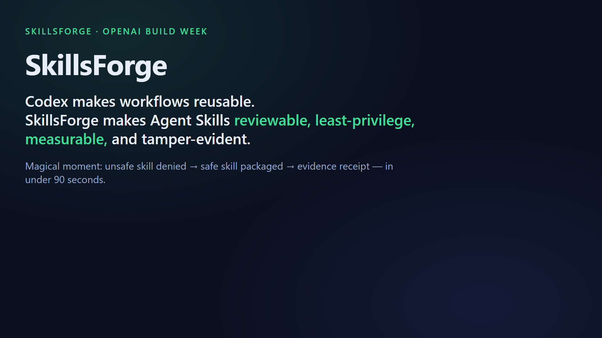
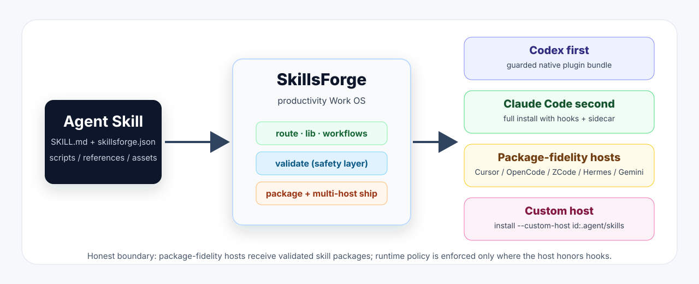
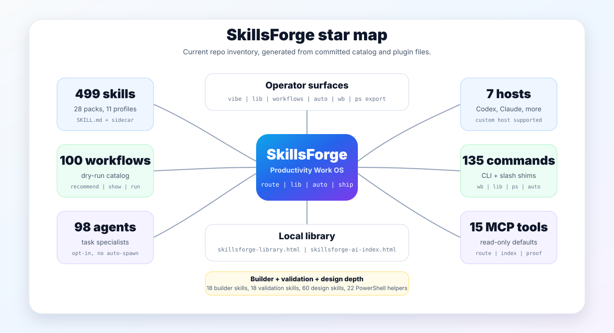
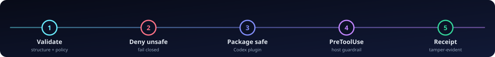
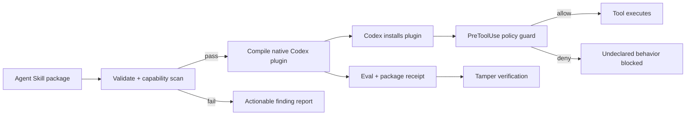

[](https://github.com/Tlkh201313/SkillsForge/actions/workflows/ci.yml)


[](LICENSE)

**Codex makes workflows reusable. SkillsForge makes Agent Skills reviewable, least-privilege, measurable, tamper-evident, and installable across AI CLIs with honest trust boundaries.**

SkillsForge is a Developer Tools **trust engine** for portable [Agent Skills](https://agentskills.io/specification): validate, deny unsafe inputs, package safe skills, enforce host hooks where supported, install package-fidelity skills across AI CLIs, and verify tamper-evident receipts. Current cataloged inventory: 366 skill entries, 26 packs, 10 profiles, and 100 reusable workflows.

---

## Demo video



The packaged MP4 is committed at [`assets/video/skillsforge-demo.mp4`](assets/video/skillsforge-demo.mp4). GitHub repository README playback for committed MP4 files is not reliable across views, so the poster stays visible and the video file remains directly available. For final judging, upload the same H.264 MP4 to a GitHub issue or PR comment and paste the generated `github.com/user-attachments/assets/...` URL here; GitHub documents `.mp4`, `.mov`, and `.webm` as supported media attachments and recommends H.264 for compatibility: [GitHub attaching files](https://docs.github.com/en/get-started/writing-on-github/working-with-advanced-formatting/attaching-files).





| Beat | What you’ll see |
|---|---|
| Thesis | Why untrusted Agent Skills are a real operator risk |
| **Unsafe deny** | `examples/codex-unsafe-release` fails validation — undeclared exec/network blocked **without executing** the skill |
| **Safe package** | `examples/codex-safe-release` passes → compiles to a guarded Codex plugin tree |
| **Receipt** | Tamper-evident receipt hash for packaged bytes |
| Scale punchline | 366 catalog entries / 26 packs / 98 agents / 124 commands / 100 workflows, verified locally |
| CTA | Clone + `node plugins/skillsforge/bin/skillsforge.mjs demo` |

---

## Why SkillsForge

Agent Skills travel across hosts. A “release helper” can ship undeclared shell, network, or write paths — and most catalogs optimize for **surface**, not **trust**.

Most skill packs solve discovery. SkillsForge solves trust: what can this skill do, can it be packaged safely, and can the bytes be verified later?

SkillsForge closes that gap:

1. **Static capability scan** against a `skillsforge.json` sidecar (100% of catalog skills carry one)
2. **Fail closed** on undeclared capabilities before anything is packaged
3. **Compile** one safe skill into a guarded native Codex plugin (`package --host codex`)
4. **Enforce** at PreToolUse when the host honors the decision
5. **Prove** bytes with an unsigned, reproducible receipt hash





---

## Why this idea (vs ECC, Superpowers, gstack)

We built SkillsForge **because** Everything Claude Code (ECC) and Superpowers already exist — and still leave a trust hole.

| Project | What it’s great at | What SkillsForge adds |
|---|---|---|
| **ECC-class packs** | Surface completeness, profiles, cross-harness breadth | A **trust pipeline** (sidecars, validate/package, PreToolUse, receipts) — not another pack dump |
| **Superpowers** | Discipline / TDD iron laws | Those laws as skills **plus** capability policy, SkillShield (best-effort), and operator CLI (`demo` / `vibe` / `quality`) |
| **gstack** (briefly) | Role lenses, ship/QA workflows | Portable skill packages with trust sidecars; we do **not** clone browse daemons or binaries |

**Honest differentiation** ([docs/competitive-matrix.md](docs/competitive-matrix.md), [docs/inspiration.md](docs/inspiration.md)):

| Dimension | SkillsForge local evidence |
|---|---|
| Core pitch | Trust engine for Agent Skills |
| Trust sidecars | 366/366 catalog skills ship `skillsforge.json` |
| Trust pipeline | validate -> package -> PreToolUse -> receipt |
| Operator CLI | `demo`, `vibe`, `quality`, `bench`, `compare-skill`, `evidence` |
| SkillShield | Skill-body scanner, best-effort static gate |
| Pressure | Fixture gate now; broader behavioral pressure is future work |
| MCP | Thin trust MCP: `validate`, `route`, `skillshield`, plus read-only library/workflow recommendation |

Inspiration is attributed; skill bodies are original SkillsForge text. Judges should hit the trust demo first.

---

## Magical moment (&lt;90s)

```sh
git clone https://github.com/Tlkh201313/SkillsForge.git
cd SkillsForge
npm ci
node plugins/skillsforge/bin/skillsforge.mjs demo
```

You should see: **unsafe deny -> safe package -> receipt hash**.

Optional follow-ups:

```sh
node plugins/skillsforge/bin/skillsforge.mjs compare-skill --a examples/codex-unsafe-release --b examples/codex-safe-release
node plugins/skillsforge/bin/skillsforge.mjs hosts
node plugins/skillsforge/bin/skillsforge.mjs vibe
node plugins/skillsforge/bin/skillsforge.mjs catalog --pack trust
```

Timed script: [docs/hackathon-demo.md](docs/hackathon-demo.md). Roadmap: [docs/roadmap-next.md](docs/roadmap-next.md).

---

## What you get today

| Surface | Actual implementation |
|---|---|
| One plugin | `skillsforge` (Claude + Codex manifests) |
| Trust demo | `skillsforge demo` -- unsafe deny -> safe package -> receipt |
| Catalog | **366** skills, **26** packs, **10** profiles -- `catalog/skillsforge.catalog.yaml` |
| Sidecars | **100%** (`skillsforge.json` beside every production skill) |
| Depth honesty | Stable trust skills are deeper; domain packs are lean scaffolds until individually expanded |
| Agents | **98** agents (depth varies -- fuller leads vs thinner task specialists) |
| Commands | **124** shims (bundled CLI first; long-tail routes by pack/query) |
| Workflow catalog | **100** dry-run workflow definitions under `plugins/skillsforge/workflows/` |
| Operator CLI | `vibe`, `catalog`, `quality`, `bench`, `scorecard`, `scaffold`, `pressure`, `skillshield`, `compare-skill`, … |
| Trust CLI | `validate`, `doctor`, `route`, `forge`, `receipt`, `package`, `evidence`, `demo`, `enforce` |
| Workbench CLI | `wb status|tree|find|grep|diff|errors|bigfiles|recent|proof` |
| Library UI | `lib build` / `lib update` create single-file HTML + AI index across repo and installed user skills; `lib serve` is localhost and read-only by default |
| Library recommendation | `lib recommend --query "..." --session-host codex` scores skills/workflows from the current library index, not a hardcoded list |
| Auto router | `auto plan`, `auto run --read-only` recommend skills/workflows without writes |
| PowerShell helpers | `ps export` emits `sf-*.ps1` wrappers, including `sf-lib-update`, `sf-recommend`, `sf-workflow`, and `sf-auto` |
| Thin MCP | `scripts/skillsforge-mcp.mjs` exposes trust tools plus read-only library/workflow recommendation |
| Evidence | Deterministic trust/eval bundle (`skillsforge evidence`) |
| Universal hosts | `hosts`, `install --hosts all|detected`, `install --custom-host <id>:<skills-dir>` |

### Host support

| Host | Status | What that means |
|---|---|---|
| Codex CLI | **Native plugin + guarded package** | Marketplace via `.agents/plugins/marketplace.json`; `package --host codex` → PreToolUse hooks; `install` copies packages to `~/.agents/skills` |
| Claude Code | Full | Marketplace, SessionStart, skill-scoped PreToolUse, bundled CLI, receipts, eval |
| Cursor | Package fidelity | Complete skill dirs + thin `rules/` — **not** runtime policy parity |
| OpenCode | Package fidelity | Complete skill package install — no runtime policy parity |
| ZCode-compatible local agent | Package fidelity | Complete skill package install — verify the configured local skills directory |
| Hermes Agent | Package fidelity | Complete skill package install — no runtime policy parity |
| Gemini CLI | Package fidelity | Complete skill package install — no runtime policy parity |
| Custom AI CLI | Package fidelity | `install --custom-host my-agent:.my-agent/skills` copies validated skills under your home directory |

---

## Install

### Codex (native plugin)

From a clone of this repository:

**POSIX**

```sh
codex plugin marketplace add "$(pwd)"
codex plugin list --json
codex plugin add skillsforge@skillsforge-marketplace
```

**Windows (PowerShell)**

```powershell
codex plugin marketplace add (Get-Location).Path
codex plugin list --json
codex plugin add skillsforge@skillsforge-marketplace
```

Marketplace: [`.agents/plugins/marketplace.json`](.agents/plugins/marketplace.json) → `plugins/skillsforge` ([`.codex-plugin/plugin.json`](plugins/skillsforge/.codex-plugin/plugin.json)).

Codex **runtime** policy for an external skill requires `skillsforge package --host codex` (one guarded skill → native plugin), not `install` alone.

### Claude Code

```text
/plugin marketplace add Tlkh201313/SkillsForge
/plugin install skillsforge@skillsforge-marketplace
```

```text
/skillsforge:validate path/to/skill
/skillsforge:route how do I validate a skill package
/skillsforge:doctor
```

### Multi-host skill install

Inspect every known AI CLI target and its trust boundary:

```sh
node ./plugins/skillsforge/bin/skillsforge.mjs hosts
node ./plugins/skillsforge/bin/skillsforge.mjs hosts --json
```

| Host | What gets installed |
|---|---|
| Claude Code (`full`) | Entire skill package → `~/.claude/skills/<name>/` with runtime policy |
| Codex / Cursor / OpenCode / ZCode / Hermes / Gemini (`package`) | Complete skill package; Claude-only frontmatter may be stripped |
| Custom host (`package`) | Complete skill package under a user-declared skills directory inside `--home` |

Dry-run selected hosts:

```sh
node ./plugins/skillsforge/bin/skillsforge.mjs install --hosts codex,claude-code --yes --dry-run plugins/skillsforge/skills/using-skillsforge

# Token-friendly workbench, workflow routing, and local library
node ./plugins/skillsforge/bin/skillsforge.mjs wb status --json
node ./plugins/skillsforge/bin/skillsforge.mjs workflows recommend --query "safe refactor code"
node ./plugins/skillsforge/bin/skillsforge.mjs auto run --read-only --query "audit README claims"
node ./plugins/skillsforge/bin/skillsforge.mjs lib update --session-host codex
node ./plugins/skillsforge/bin/skillsforge.mjs lib recommend --query "audit README claims" --session-host codex
node ./plugins/skillsforge/bin/skillsforge.mjs ps export
node ./plugins/skillsforge/bin/skillsforge.mjs install --hosts all --yes --dry-run plugins/skillsforge/skills/using-skillsforge
node ./plugins/skillsforge/bin/skillsforge.mjs install --hosts detected --yes --dry-run plugins/skillsforge/skills/using-skillsforge
node ./plugins/skillsforge/bin/skillsforge.mjs install --custom-host my-agent:.my-agent/skills --yes --dry-run plugins/skillsforge/skills/using-skillsforge
```

Known host ids: `claude-code`, `cursor`, `codex`, `opencode`, `zcode`, `hermes`, `gemini`. Details: [docs/universal-hosts.md](docs/universal-hosts.md).

---

## Core CLI

Requires Node.js ≥ 20. Build once for the bundled binary (marketplace installs already ship it):

```sh
npm ci
npm run build
node ./plugins/skillsforge/bin/skillsforge.mjs help
```

On Windows PowerShell, always invoke with Node:

```powershell
node .\plugins\skillsforge\bin\skillsforge.mjs help
```

Exit codes: `0` success · `1` failure · `2` invalid usage.

| Command | Purpose |
|---|---|
| `demo` | Judge path: unsafe deny → safe package → receipt |
| `hosts` | List detected AI CLI targets, fidelity, and trust boundary |
| `validate [paths…]` | Structure + capability policy (when sidecar present) |
| `package --host codex` | One skill → guarded Codex plugin (`--dry-run` default; `--write` to materialize) |
| `receipt` / `verify-receipt` | Build / verify tamper-evident package receipt |
| `enforce --policy <sidecar>` | PreToolUse allow/deny from stdin event JSON |
| `evidence --out <dir>` | Deterministic trust/eval evidence bundle |
| `route --query <text>` | Explainable skill routing |
| `forge --spec <file>` | Deterministic skill generation (`--dry-run` / `--write`) |
| `doctor` | Plugin + installed-skill health |
| `install` | Multi-host skill install (interactive or `--hosts` + `--yes`) |
| `vibe` / `catalog` / `quality` | Magical moment, pack browse, quality score 0–100 |
| `skillshield` / `pressure` | Best-effort body scan / fixture pressure gate |
| `compare-skill --a … --b …` | Side-by-side trust delta |
| `eval` | Holdout routing evaluation (P/R gate) |
| `wb` | Token-friendly repo status, search, diff, large-file, and proof helpers |
| `lib` | Build/update/serve/check/recommend from the local skill library HTML and AI index |
| `workflows` | List, show, recommend, or dry-run one of 100 workflows |
| `auto` | Recommend the smallest matching skill and workflow without writes |
| `ps export` | Generate PowerShell `sf-*.ps1` helpers |

Full flag list: `skillsforge help`. Architecture: [docs/architecture.md](docs/architecture.md).

### Quick examples

```sh
# Validate
node ./plugins/skillsforge/bin/skillsforge.mjs validate examples/codex-safe-release
node ./plugins/skillsforge/bin/skillsforge.mjs validate --all

# Universal host inventory and dry-run install
node ./plugins/skillsforge/bin/skillsforge.mjs hosts
node ./plugins/skillsforge/bin/skillsforge.mjs install --hosts codex,claude-code --yes --dry-run plugins/skillsforge/skills/using-skillsforge

# Package (POSIX) — dry-run first
node ./plugins/skillsforge/bin/skillsforge.mjs package --host codex \
  --skill examples/codex-safe-release --out /tmp/codex-safe-release-plugin --dry-run

# Unsafe skills fail closed before any write
node ./plugins/skillsforge/bin/skillsforge.mjs package --host codex \
  --skill examples/codex-unsafe-release --out /tmp/should-not-exist --write
# exits non-zero; --out stays empty / unwritten

# Evidence + receipt
node ./plugins/skillsforge/bin/skillsforge.mjs evidence --out artifacts/evidence
node ./plugins/skillsforge/bin/skillsforge.mjs receipt --out dist/trust-receipt.json --package dist/codex
```

```powershell
# Package (Windows)
node .\plugins\skillsforge\bin\skillsforge.mjs package --host codex `
  --skill examples\codex-safe-release --out $env:TEMP\codex-safe-release-plugin --dry-run
```

### Demo examples

| Example | Intent |
|---|---|
| [`examples/codex-unsafe-release/`](examples/codex-unsafe-release/) | Undeclared exec + network — **FAIL** validate / package |
| [`examples/codex-safe-release/`](examples/codex-safe-release/) | Least-privilege declarations — **PASS** validate / package |
| [`examples/safe-dependency-upgrade/`](examples/safe-dependency-upgrade/) | Forge-spec dry-run fixture |

---

## Claim boundaries / security

### Anti-goals (not claimed)

This release does **not** ship or claim: Ruflo swarms, AgentDB, consensus, OS sandboxing, or third-party attestation. The local library UI is a generated developer tool, not a cloud dashboard. Domain packs are **lean curated scaffolds**, not unvalidated dumps from skills.sh.

### Say aloud

- **Hook guardrail ≠ OS sandbox.** PreToolUse denies matched tools when the host honors the decision; it does not confine processes or replace containers/VMs.
- **Regex / static checks are best-effort.** Encoded payloads and unscanned binaries can bypass the scanner. SkillShield is a **skill-body scanner (best-effort)**.
- **Pressure = fixture gate + expanding.** Fixtures check expected violation/compliance shape today; behavioral agent pressure is expanding.
- **Receipts are unsigned tamper evidence.** Reproducible hashes prove bytes changed; they are not third-party certification.
- **No copied third-party skill bodies.** Inspiration is attributed; bodies are original SkillsForge text.
- **Honest depth:** 366 catalog entries; stable trust skills are deeper, and domain packs stay lean until expanded with examples/evals.
- **No invented Session IDs or stats.** If provenance is missing, omit the claim.

### Security boundary

- Skill scripts are never executed during validation.
- Local Markdown resources must remain inside the skill directory after real-path resolution.
- Only HTTP, HTTPS, mailto, fragment, and valid local links are accepted.
- Empty production skill libraries fail closed unless `--allow-empty` is explicitly supplied.
- Codex does not comprehensively intercept every tool path; changed hooks need `/hooks` trust review; invalid hook output can fail open at the host.

Threat model: [docs/threat-model.md](docs/threat-model.md).

### Validation profiles

| Capability | `canonical` | `claude-code` |
|---|:---:|:---:|
| Agent Skills core fields | ✓ | ✓ |
| `metadata` string map | ✓ | ✓ |
| Portable `allowed-tools` string | ✓ | ✓ |
| Claude tool arrays / invocation / hooks | — | ✓ |
| Unknown top-level fields | Rejected | Rejected |

Put portable project-specific values under `metadata`. Select `claude-code` only when the package intentionally uses Claude extensions.

---

## Verification

```sh
npm ci
npm run check
```

`npm run check` runs validate, test, eval, demo, build, `build:dist`, `smoke:dist`, hard `validate:host`, and evidence. Evidence artifacts: eval report, host-validation JSON, receipt, Codex dist, evidence bundle.

### Docs map

| Doc | Use |
|---|---|
| [docs/architecture.md](docs/architecture.md) | Surfaces, Codex compile, hook flow |
| [docs/universal-hosts.md](docs/universal-hosts.md) | AI CLI host modes, custom install, and policy boundaries |
| [docs/threat-model.md](docs/threat-model.md) | Trust boundaries and limitations |
| [docs/hackathon-demo.md](docs/hackathon-demo.md) | Timed judge script |
| [docs/competitive-matrix.md](docs/competitive-matrix.md) | Claim boundaries for external comparisons |
| [docs/inspiration.md](docs/inspiration.md) | No-copy attribution |
| [docs/roadmap-next.md](docs/roadmap-next.md) | Post-0.4.0 priorities |

---

## License

[MIT](LICENSE) © 2026 Tlkh201313.
