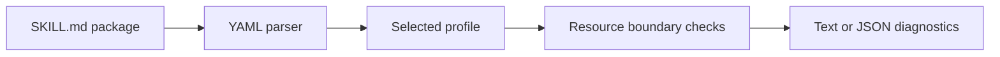
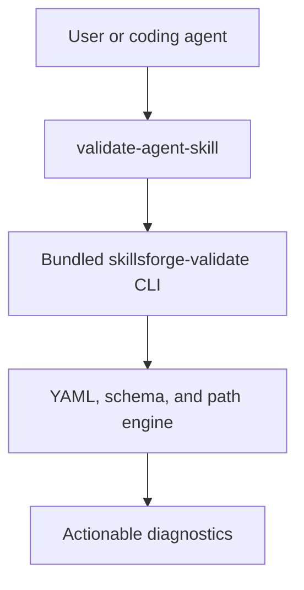

[](https://github.com/Tlkh201313/SkillsForge/actions/workflows/ci.yml)


[](LICENSE)

SkillsForge validates portable [Agent Skills](https://agentskills.io/specification) packages and supported Claude Code extensions. The current release is deliberately focused: one production skill, one bundled validator, two explicit validation profiles, and no placeholder features.

## What ships today

| Surface | Actual implementation |
|---|---|
| Claude Code skill | `validate-agent-skill` reviews and validates a requested skill package |
| Standalone command | `skillsforge-validate` is bundled into one executable Node.js file |
| Portable profile | Enforces the Agent Skills name, description, metadata, compatibility, license, and tool fields |
| Claude Code profile | Adds supported Claude-specific invocation, tool, model, context, agent, and hook fields |
| Diagnostics | Human-readable output and structured JSON with non-zero failure exits |
| Safety | Reads skill metadata and resources without executing bundled skill scripts |

Routing, generation, synchronization, adapters, and orchestration are not implemented or advertised as working commands.

## Validation pipeline



The parser accepts valid BOM, CRLF, comments, quoted values, and multiline YAML. Profile validation uses Draft 2020-12 JSON Schema. Resource checks reject missing files, unsupported URI schemes, sibling-prefix escapes, and links whose real path leaves the skill directory.

## Install in Claude Code

```text
/plugin marketplace add Tlkh201313/SkillsForge
/plugin install skillsforge@skillsforge-marketplace
```

Invoke the installed skill with a path:

```text
/skillsforge:validate-agent-skill path/to/skill
```

Claude Code loads the skill, runs the bundled command, and reports structural failures before qualitative advice.

## Use the validator directly

```sh
npm ci
npm run build

# Portable Agent Skills specification
./bin/skillsforge-validate path/to/skill

# Portable fields plus supported Claude Code extensions
./bin/skillsforge-validate --profile claude-code path/to/skill

# Machine-readable diagnostics
./bin/skillsforge-validate --json path/to/skill

# Every production skill under ./skills
./bin/skillsforge-validate --all
```

On Windows PowerShell, use Node explicitly:

```powershell
node .\bin\skillsforge-validate path\to\skill
```

## Profiles

| Capability | `canonical` | `claude-code` |
|---|:---:|:---:|
| Agent Skills core fields | ✓ | ✓ |
| `metadata` string map | ✓ | ✓ |
| Portable `allowed-tools` string | ✓ | ✓ |
| Claude tool arrays | — | ✓ |
| Invocation controls | — | ✓ |
| Claude model, context, agent, and hooks | — | ✓ |
| Unknown top-level fields | Rejected | Rejected |

Put portable project-specific values under `metadata`. Select `claude-code` only when the package intentionally uses Claude extensions.

## Runtime architecture



The committed CLI bundle contains its runtime dependencies, so a marketplace installation does not run `npm install`. Source and bundle drift is blocked by `npm run build:check`.

## Example output

Successful package:

```text
PASS validate-agent-skill (canonical)
```

Invalid package:

```text
FAIL example-skill
  - frontmatter / must contain description
  - relative markdown link must resolve: references/missing.md
```

Exit codes are `0` for success, `1` for validation failure, and `2` for invalid CLI usage.

## Verification

```sh
npm run validate:manifests
npm run validate:plugin
npm run validate
npm test
npm run build:check
```

GitHub Actions runs the validation and test suite on Ubuntu, Windows, and macOS with Node.js 20 and 22. A separate release-contract job runs Claude Code's strict plugin validator and verifies the committed CLI bundle.

## Security boundary

- Skill scripts are never executed during validation.
- Local Markdown resources must remain inside the skill directory after real-path resolution.
- Only HTTP, HTTPS, mailto, fragment, and valid local links are accepted.
- Empty production skill libraries fail closed unless `--allow-empty` is explicitly supplied.
- Manifest versions must match across `package.json`, `plugin.json`, and `marketplace.json`.

## License

[MIT](LICENSE) © 2026 Tlkh201313.
