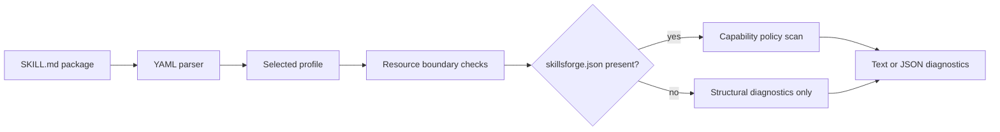
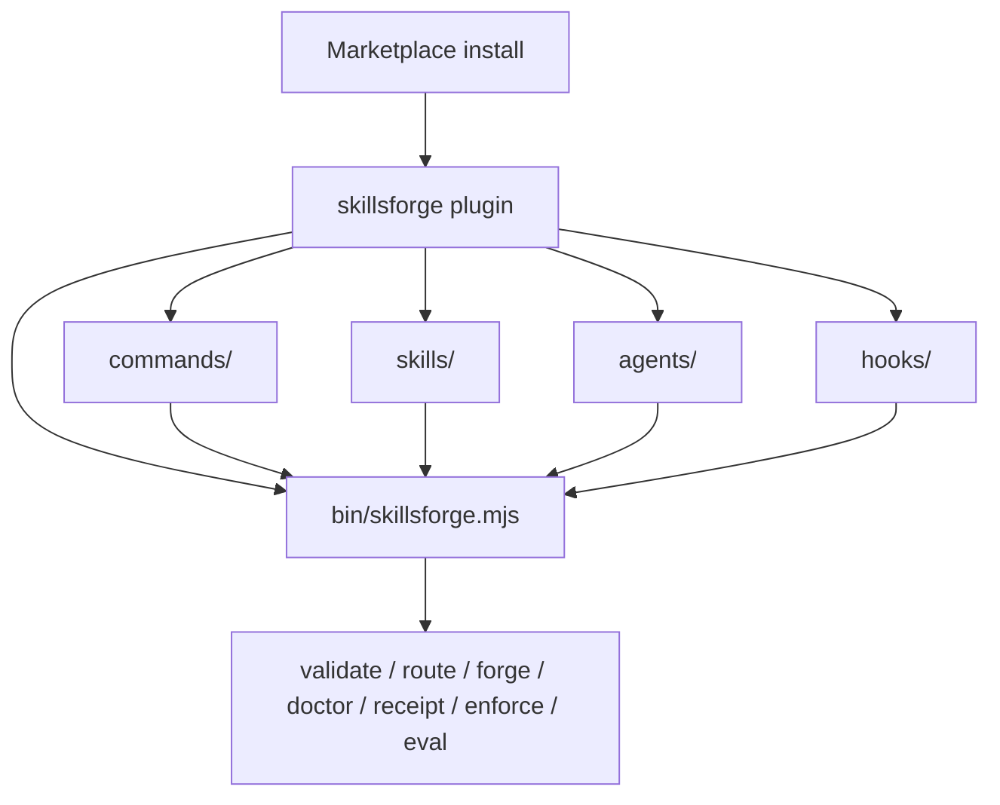
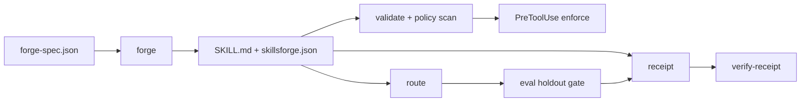

[](https://github.com/Tlkh201313/SkillsForge/actions/workflows/ci.yml)


[](LICENSE)

SkillsForge ships **one** production plugin: a capability / trust engine for portable [Agent Skills](https://agentskills.io/specification). Version 0.3.0 validates, forges, routes, policy-scans, and packages skills with evidence receipts — primarily for Claude Code.

## Host support matrix

| Host | Status | What that means |
|---|---|---|
| Claude Code | Full | Marketplace install, SessionStart, skill-scoped PreToolUse guardrails, bundled `skillsforge` CLI, receipts, eval |
| Cursor | Proof | Deterministic `SKILL.md` export plus lossiness report — not runtime policy parity |
| Codex | Unsupported | Not packaged or claimed |
| OpenCode | Unsupported | Not packaged or claimed |

## What ships today

| Surface | Actual implementation |
|---|---|
| One plugin | `skillsforge` only |
| Slash commands | `validate`, `route`, `forge`, `doctor`, `verify-receipt` |
| Claude Code skills | `validate-agent-skill`, `author-capability`, `route-capability`, `verify-capability`, `using-skillsforge` |
| Runtime CLI | Full `skillsforge` CLI (`validate`, `doctor`, `route`, `forge`, `receipt`, `verify-receipt`, `enforce`, `eval`, `help`) + `skillsforge-validate` shim |
| Canonical sidecar | `skillsforge.json` (routing, capabilities, compatibility) validated with Ajv |
| Forge | Deterministic skill generation from forge-spec (`--dry-run` / `--write`) |
| Routing | Explainable scores with holdout evaluation gate |
| Policy | Static scan + skill-scoped PreToolUse enforce (guardrails ≠ OS sandbox) |
| Receipts | Reproducible full-package hashes + Cursor lossiness proof |
| Diagnostics | Human-readable and JSON output with non-zero failure exits |

## Anti-goals (not claimed)

This release does **not** ship or claim: MCP servers, LSP, monitors, token / usage ledgers, domain skill packs, multi-host runtime parity, OS sandboxing, or third-party attestation.

## Validation pipeline



The parser accepts valid BOM, CRLF, comments, quoted values, and multiline YAML. Profile validation uses Draft 2020-12 JSON Schema. Resource checks reject missing files, unsupported URI schemes, sibling-prefix escapes, and links whose real path leaves the skill directory. Sidecar skills also fail closed on blocking policy findings.

## Plugin component map



## Trust pipeline



The committed CLI bundle contains its runtime dependencies, so a marketplace installation does not run `npm install`. Source and bundle drift is blocked by `npm run build:check`.

## Plugin

| Plugin | Purpose | Version 0.3.0 | Install command |
|---|---|:---:|---|
| `skillsforge` | Capability trust engine: forge, validate, route, policy-enforce, package | Available | `/plugin install skillsforge@skillsforge-marketplace` |

### Plugin components

| Component | Paths | What you get |
|---|---|---|
| Slash commands | `commands/` | `/skillsforge:validate`, `/skillsforge:route`, `/skillsforge:forge`, `/skillsforge:doctor`, `/skillsforge:verify-receipt` |
| Skills | `skills/` | `validate-agent-skill`, `author-capability`, `route-capability`, `verify-capability`, `using-skillsforge` |
| Agents | `agents/` | `validator` (explain-only after authoritative checks) |
| Hooks | `hooks/` | `SessionStart` banner + skill-scoped `PreToolUse` policy guardrails |
| CLI | `bin/` | Bundled `skillsforge.mjs` + `skillsforge-validate` shim |

See [docs/architecture.md](docs/architecture.md), [docs/threat-model.md](docs/threat-model.md), and [docs/hackathon-demo.md](docs/hackathon-demo.md).

## Install in Claude Code

```text
/plugin marketplace add Tlkh201313/SkillsForge
/plugin install skillsforge@skillsforge-marketplace
```

Invoke a slash command:

```text
/skillsforge:validate path/to/skill
/skillsforge:route how do I validate a skill package
/skillsforge:doctor
```

Or invoke an installed skill:

```text
/skillsforge:validate-agent-skill path/to/skill
```

Claude Code loads the command or skill, runs the bundled CLI, and reports structural or policy failures before qualitative advice.

## CLI reference

Build once, then use the bundled binary (marketplace installs already ship it):

```sh
npm ci
npm run build
node ./plugins/skillsforge/bin/skillsforge.mjs help
```

On Windows PowerShell, always invoke with Node:

```powershell
node .\plugins\skillsforge\bin\skillsforge.mjs help
```

The `skillsforge-validate` shim forwards to `skillsforge validate`.

Exit codes for every command: `0` success, `1` failure, `2` invalid usage.

### `validate`

Validate skill packages (YAML / schema / paths). When a `skillsforge.json` sidecar is present, also run the capability policy scan.

```sh
node ./plugins/skillsforge/bin/skillsforge.mjs validate path/to/skill
node ./plugins/skillsforge/bin/skillsforge.mjs validate --profile claude-code path/to/skill
node ./plugins/skillsforge/bin/skillsforge.mjs validate --json path/to/skill
node ./plugins/skillsforge/bin/skillsforge.mjs validate --all
node ./plugins/skillsforge/bin/skillsforge.mjs validate --all --allow-empty
```

Flags: `--json`, `--all`, `--allow-empty`, `--profile <canonical|claude-code>` (default `canonical`).

Shim:

```sh
./plugins/skillsforge/bin/skillsforge-validate --profile claude-code path/to/skill
```

### `doctor`

Plugin and installed-skill health checks (includes blocking policy findings).

```sh
node ./plugins/skillsforge/bin/skillsforge.mjs doctor
node ./plugins/skillsforge/bin/skillsforge.mjs doctor --json
```

### `route`

Explainable skill routing for a natural-language query.

```sh
node ./plugins/skillsforge/bin/skillsforge.mjs route --query "validate this skill package"
```

### `forge`

Deterministic skill generation from a forge-spec. Dry-run is the default; `--write` materializes files.

```sh
node ./plugins/skillsforge/bin/skillsforge.mjs forge --spec examples/safe-dependency-upgrade/forge-spec.json --dry-run
node ./plugins/skillsforge/bin/skillsforge.mjs forge --spec path/to/forge-spec.json --write
node ./plugins/skillsforge/bin/skillsforge.mjs forge --spec path/to/forge-spec.json --write --force --out path/to/skills
```

Flags: `--spec <file>` (required), `--dry-run`, `--write`, `--force`, `--out <dir>`.

### `receipt`

Build a trust receipt over packaged plugin bytes (optional evaluation evidence).

```sh
node ./plugins/skillsforge/bin/skillsforge.mjs receipt --out dist/trust-receipt.json --package dist/claude-code
node ./plugins/skillsforge/bin/skillsforge.mjs receipt --out dist/trust-receipt.json --package dist/claude-code --evaluation artifacts/evaluation/routing-report.json --require-evaluation
```

Flags: `--out <file>`, `--package <dir>`, `--evaluation <file>`, `--require-evaluation`.

### `verify-receipt`

Verify a receipt against package bytes and optional evaluation report.

```sh
node ./plugins/skillsforge/bin/skillsforge.mjs verify-receipt dist/trust-receipt.json --package dist/claude-code --package-only
node ./plugins/skillsforge/bin/skillsforge.mjs verify-receipt dist/trust-receipt.json --package dist/claude-code --evaluation artifacts/evaluation/routing-report.json
```

Flags: `--package <dir>`, `--evaluation <file>`, `--package-only`.

### `enforce`

Decide PreToolUse allow/deny from a sidecar policy. Reads the Claude tool-use event JSON from stdin (hook runtime).

```sh
echo '{"tool_name":"WebSearch","tool_input":{"query":"x"}}' | node ./plugins/skillsforge/bin/skillsforge.mjs enforce --policy path/to/skillsforge.json
```

Flag: `--policy <sidecar.json>` (required).

### `eval`

Run the holdout routing evaluation gate (precision / recall thresholds).

```sh
node ./plugins/skillsforge/bin/skillsforge.mjs eval
# or
npm run eval
```

### `help`

```sh
node ./plugins/skillsforge/bin/skillsforge.mjs help
```

## Profiles

| Capability | `canonical` | `claude-code` |
|---|:---:|:---:|
| Agent Skills core fields | ✓ | ✓ |
| `metadata` string map | ✓ | ✓ |
| Portable `allowed-tools` string | ✓ | ✓ |
| Claude tool arrays | — | ✓ |
| Invocation controls | — | ✓ |
| Claude model, context, agent, and hooks | — | ✓ |
| Unknown top-level fields | Rejected | Rejected |

Put portable project-specific values under `metadata`. Select `claude-code` only when the package intentionally uses Claude extensions.

## Example output

Successful package:

```text
PASS validate-agent-skill (canonical)
```

Invalid package:

```text
FAIL example-skill
  - frontmatter / must contain description
  - relative markdown link must resolve: references/missing.md
```

## Verification

Run the same release-contract dry run locally from the repository root:

```sh
npm ci
npm run check
```

`npm run check` includes validate, test, eval, demo, build, `build:dist`, `smoke:dist`, and hard `validate:host` (`claude plugin validate --strict` via local `@anthropic-ai/claude-code`; no soft-skip).

GitHub Actions runs the unit matrix on Ubuntu, Windows, and macOS with Node.js 20 and 22. The release-contract job (Ubuntu) runs the full gate including demo, `build:dist`, `smoke:dist`, and `validate:host`. A Windows release-smoke job covers test + demo + dist + host validate. Evidence artifacts: eval report, host-validation JSON, receipt, lossiness, smoke log.

## Security boundary

- Skill scripts are never executed during validation.
- Local Markdown resources must remain inside the skill directory after real-path resolution.
- Only HTTP, HTTPS, mailto, fragment, and valid local links are accepted.
- Empty production skill libraries fail closed unless `--allow-empty` is explicitly supplied.
- PreToolUse hooks are guardrails honored by the host — not an OS sandbox.
- `VERSION`, `package.json`, every plugin and marketplace entry, and the README badge must use the same release version.

## License

[MIT](LICENSE) © 2026 Tlkh201313.
