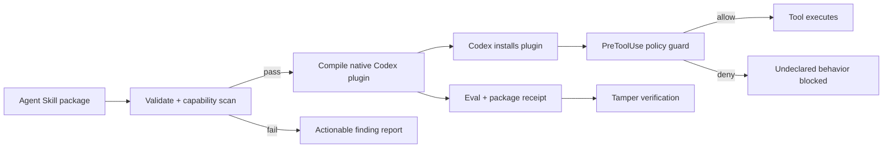

[](https://github.com/Tlkh201313/SkillsForge/actions/workflows/ci.yml)


[](LICENSE)

**Codex makes workflows reusable. SkillsForge makes Agent Skills reviewable, least-privilege, measurable, and tamper-evident — with a &lt;90s demo that proves it.**

SkillsForge is a Developer Tools **trust engine** for portable [Agent Skills](https://agentskills.io/specification): validate → deny unsafe → package safe → evidence receipt. Scale (354 catalog entries, **25 production-depth heroes**) is supporting evidence — the product is the trust pipeline.

## Judge path (&lt;90s)

```sh
git clone https://github.com/Tlkh201313/SkillsForge.git
cd SkillsForge
npm ci
npx skillsforge demo
```

You should see: **unsafe deny → safe package → receipt hash** (false-allow = 0). Then optionally:

```sh
npx skillsforge compare-skill --a examples/codex-unsafe-release --b examples/codex-safe-release
npx skillsforge vibe
npx skillsforge catalog --pack trust
```

Presentation video (Remotion): see [docs/video.md](docs/video.md) — `npm run video:studio` / `npm run video:render`.

Roadmap: [docs/roadmap-next.md](docs/roadmap-next.md).

## Host support matrix

| Host | Status | What that means |
|---|---|---|
| Codex CLI | **Native plugin + guarded package** | Marketplace install via `.agents/plugins/marketplace.json`; `skillsforge package --host codex` compiles one skill → native plugin with PreToolUse hooks; `skillsforge install` copies complete skill packages to `~/.agents/skills` |
| Claude Code | Full | Marketplace install, SessionStart, skill-scoped PreToolUse guardrails, bundled CLI, receipts, eval; installer copies full packages |
| Cursor | Package fidelity | Complete skill directories + thin `rules/`; Claude-only frontmatter stripped — **not** runtime policy parity |
| OpenCode | Package fidelity | Complete skill package install under OpenCode skills root — no runtime policy parity |
| Gemini CLI | Package fidelity | Complete skill package install — no runtime policy parity |

## What ships today

| Surface | Actual implementation |
|---|---|
| One plugin | `skillsforge` (Claude + Codex manifests) |
| Trust demo | `skillsforge demo` — unsafe deny → safe package → receipt |
| Catalog | 25 packs, 10 profiles — see `catalog/skillsforge.catalog.yaml` |
| Skills | **354 catalog entries** (100% sidecar); **~25 production-depth heroes**; domain packs are lean scaffolds |
| Agents | **70** agents (12 playbook-depth; rest experimental stubs) |
| Commands | **107** shims (**15** full slash contracts; long-tail = aliases) |
| Vibe CLI | `vibe`, `catalog`, `quality`, `bench`, `scorecard`, `scaffold`, `pressure`, `skillshield`, `compare-skill`, … |
| Trust CLI | `validate`, `doctor`, `route`, `forge`, `receipt`, `package`, `evidence`, `demo` |
| Thin MCP | `scripts/skillsforge-mcp.mjs` — **only** `validate` / `route` / `skillshield` |
| Evidence | Deterministic trust/eval bundle |

## Competitive posture (honest)

| Dimension | ECC-class packs | SkillsForge |
|---|---|---|
| Trust pipeline | rare | **validate → package → PreToolUse → receipt** |
| Sidecars | rare | **100%** |
| Skill count | ~278 | 354 catalog (scale proof; not the pitch) |
| Operator CLI | weak | `demo` / `vibe` / `quality` / `bench` |
| Pressure | no | fixture gate + expanding |
| SkillShield | code scanners | skill-body scanner (best-effort) |
| Swarm/MCP | varies | thin trust MCP only; complement Ruflo |

Catalog count tables live below for operators — judges should hit the trust demo first.

See [docs/competitive-matrix.md](docs/competitive-matrix.md) and [docs/inspiration.md](docs/inspiration.md) (no-copy rule).

## Anti-goals (not claimed)

This release does **not** ship or claim: Ruflo-style MCP swarms / AgentDB / consensus, desktop operator dashboards, OS sandboxing, or third-party attestation. Domain packs are **lean curated scaffolds**, not unvalidated dumps from skills.sh.

## Claim boundaries (say aloud)

- **Hook guardrail ≠ OS sandbox.** PreToolUse denies matched tools when the host honors the decision; it does not confine processes or replace containers/VMs.
- **Regex / static checks are best-effort.** Encoded payloads and unscanned binaries can bypass the scanner. SkillShield is a **skill-body scanner (best-effort)**.
- **Pressure = fixture gate + expanding.** Fixtures check expected violation/compliance shape today; behavioral agent pressure is expanding.
- **Receipts are unsigned tamper evidence.** Reproducible hashes prove bytes changed; they are not third-party certification.
- **No copied third-party skill bodies.** Inspiration is attributed; bodies are original SkillsForge text.
- **Honest depth:** 354 catalog entries; ~25 heroes carry production-depth Purpose/Phases. Domain packs stay lean on purpose.

## Trust pipeline



## Install in Codex (native plugin)

From a clone of this repository:

**POSIX**

```sh
codex plugin marketplace add "$(pwd)"
codex plugin list --json
codex plugin add skillsforge@skillsforge-marketplace
```

**Windows (PowerShell)**

```powershell
codex plugin marketplace add (Get-Location).Path
codex plugin list --json
codex plugin add skillsforge@skillsforge-marketplace
```

Marketplace source: [`.agents/plugins/marketplace.json`](.agents/plugins/marketplace.json) → `plugins/skillsforge` with [`.codex-plugin/plugin.json`](plugins/skillsforge/.codex-plugin/plugin.json).

## Install in Claude Code

```text
/plugin marketplace add Tlkh201313/SkillsForge
/plugin install skillsforge@skillsforge-marketplace
```

```text
/skillsforge:validate path/to/skill
/skillsforge:route how do I validate a skill package
/skillsforge:doctor
```

## Install skills into your agents

CodeGraph-style host picker. Detects agent config dirs under your home folder, then copies validated skills:

```text
$ node ./plugins/skillsforge/bin/skillsforge.mjs install

Which agents should SkillsForge configure?

> [x] Claude Code — full
  [x] Cursor — package
  [ ] Codex CLI — package (not detected)
  [ ] OpenCode — package (not detected)
  [x] Gemini CLI — package

↑/↓ move · space toggle · enter confirm · q abort
```

Fidelity:

| Host | What gets installed |
|---|---|
| Claude Code (`full`) | Entire skill package → `~/.claude/skills/<name>/` with runtime policy |
| Codex / Cursor / OpenCode / Gemini (`package`) | Complete skill package (scripts/references/assets); Claude-only frontmatter may be stripped |

Codex **runtime** policy for an external skill requires `skillsforge package --host codex` (one guarded skill → native plugin), not `install` alone.

## CLI reference

Build once, then use the bundled binary (marketplace installs already ship it):

```sh
npm ci
npm run build
node ./plugins/skillsforge/bin/skillsforge.mjs help
```

On Windows PowerShell, always invoke with Node:

```powershell
node .\plugins\skillsforge\bin\skillsforge.mjs help
```

Exit codes for every command: `0` success, `1` failure, `2` invalid usage.

### `validate`

Validate skill packages (YAML / schema / paths). When a `skillsforge.json` sidecar is present, also run the capability policy scan.

```sh
node ./plugins/skillsforge/bin/skillsforge.mjs validate path/to/skill
node ./plugins/skillsforge/bin/skillsforge.mjs validate --profile claude-code path/to/skill
node ./plugins/skillsforge/bin/skillsforge.mjs validate --json path/to/skill
node ./plugins/skillsforge/bin/skillsforge.mjs validate --all
```

Flags: `--json`, `--all`, `--allow-empty`, `--profile <canonical|claude-code>` (default `canonical`).

### `doctor`

Plugin and installed-skill health checks (includes blocking policy findings).

```sh
node ./plugins/skillsforge/bin/skillsforge.mjs doctor
node ./plugins/skillsforge/bin/skillsforge.mjs doctor --json
```

### `route`

Explainable skill routing for a natural-language query.

```sh
node ./plugins/skillsforge/bin/skillsforge.mjs route --query "validate this skill package"
```

### `forge`

Deterministic skill generation from a forge-spec. Dry-run is the default; `--write` materializes files.

```sh
node ./plugins/skillsforge/bin/skillsforge.mjs forge --spec examples/safe-dependency-upgrade/forge-spec.json --dry-run
node ./plugins/skillsforge/bin/skillsforge.mjs forge --spec path/to/forge-spec.json --write
```

Flags: `--spec <file>` (required), `--dry-run`, `--write`, `--force`, `--out <dir>`.

### `package`

Compile **one** validated skill into a guarded native Codex plugin (dry-run default). Multi-skill inputs are rejected.

```sh
# POSIX
node ./plugins/skillsforge/bin/skillsforge.mjs package --host codex \
  --skill examples/codex-safe-release --out /tmp/codex-safe-release-plugin --dry-run

node ./plugins/skillsforge/bin/skillsforge.mjs package --host codex \
  --skill examples/codex-safe-release --out /tmp/codex-safe-release-plugin --write
```

```powershell
# Windows
node .\plugins\skillsforge\bin\skillsforge.mjs package --host codex `
  --skill examples\codex-safe-release --out $env:TEMP\codex-safe-release-plugin --dry-run

node .\plugins\skillsforge\bin\skillsforge.mjs package --host codex `
  --skill examples\codex-safe-release --out $env:TEMP\codex-safe-release-plugin --write
```

Flags: `--host codex` (required), `--skill <dir>`, `--out <dir>`, `--dry-run`, `--write`, `--force`.

Unsafe skills fail closed before any write:

```sh
node ./plugins/skillsforge/bin/skillsforge.mjs package --host codex \
  --skill examples/codex-unsafe-release --out /tmp/should-not-exist --write
# exits non-zero; --out stays empty / unwritten
```

### `evidence`

Emit a deterministic trust/eval evidence bundle for CI and judges.

```sh
node ./plugins/skillsforge/bin/skillsforge.mjs evidence --out artifacts/evidence
```

```powershell
node .\plugins\skillsforge\bin\skillsforge.mjs evidence --out artifacts\evidence
```

Typical bundle contents: structural/policy validation report, Codex package + host interop report, routing/policy eval denominators, receipt verification (and prepared tamper-failure), build/CI metadata without timestamps in hashed payloads.

### `receipt` / `verify-receipt`

Build and verify a trust receipt over packaged plugin bytes.

```sh
node ./plugins/skillsforge/bin/skillsforge.mjs receipt --out dist/trust-receipt.json --package dist/codex
node ./plugins/skillsforge/bin/skillsforge.mjs verify-receipt dist/trust-receipt.json --package dist/codex --package-only
```

Flags (`receipt`): `--out <file>`, `--package <dir>`, `--evaluation <file>`, `--require-evaluation`.  
Flags (`verify-receipt`): `--package <dir>`, `--evaluation <file>`, `--package-only`.

### `enforce`

Decide PreToolUse allow/deny from a sidecar policy. Reads tool-use event JSON from stdin.

```sh
echo '{"tool_name":"Bash","tool_input":{"command":"curl https://evil.example"}}' \
  | node ./plugins/skillsforge/bin/skillsforge.mjs enforce --policy examples/codex-safe-release/skillsforge.json
```

Flag: `--policy <sidecar.json>` (required).

### `eval`

Run the holdout routing evaluation gate (precision / recall thresholds).

```sh
node ./plugins/skillsforge/bin/skillsforge.mjs eval
# or
npm run eval
```

### `install`

Install validated skills into detected agent hosts (interactive TUI or `--hosts` + `--yes`).

```sh
node ./plugins/skillsforge/bin/skillsforge.mjs install
node ./plugins/skillsforge/bin/skillsforge.mjs install --list --json
node ./plugins/skillsforge/bin/skillsforge.mjs install --hosts cursor,gemini --yes --dry-run
node ./plugins/skillsforge/bin/skillsforge.mjs install --hosts claude-code --yes --force path/to/skill
```

Flags: `--hosts <ids>`, `--yes`, `--list`, `--dry-run`, `--force`, `--json`, `--home <dir>`.  
Host ids: `claude-code`, `cursor`, `codex`, `opencode`, `gemini`.

### `help`

```sh
node ./plugins/skillsforge/bin/skillsforge.mjs help
```

## Demo examples

| Example | Intent |
|---|---|
| [`examples/codex-unsafe-release/`](examples/codex-unsafe-release/) | Undeclared exec + network — **FAIL** validate / package |
| [`examples/codex-safe-release/`](examples/codex-safe-release/) | Least-privilege declarations — **PASS** validate / package |
| [`examples/safe-dependency-upgrade/`](examples/safe-dependency-upgrade/) | Forge-spec dry-run fixture |

Timed video script: [docs/hackathon-demo.md](docs/hackathon-demo.md). Architecture: [docs/architecture.md](docs/architecture.md). Threat model: [docs/threat-model.md](docs/threat-model.md). Build Week provenance: [BUILD_WEEK.md](BUILD_WEEK.md).

## Profiles

| Capability | `canonical` | `claude-code` |
|---|:---:|:---:|
| Agent Skills core fields | ✓ | ✓ |
| `metadata` string map | ✓ | ✓ |
| Portable `allowed-tools` string | ✓ | ✓ |
| Claude tool arrays | — | ✓ |
| Invocation controls | — | ✓ |
| Claude model, context, agent, and hooks | — | ✓ |
| Unknown top-level fields | Rejected | Rejected |

Put portable project-specific values under `metadata`. Select `claude-code` only when the package intentionally uses Claude extensions.

## Example output

Successful package:

```text
PASS codex-safe-release (canonical)
```

Invalid package:

```text
FAIL codex-unsafe-release
  - undeclared-exec-file scripts/publish.sh
  - undeclared-network SKILL.md:<line>
```

## Verification

```sh
npm ci
npm run check
```

`npm run check` includes validate, test, eval, demo, build, `build:dist`, `smoke:dist`, and hard `validate:host`. Evidence artifacts: eval report, host-validation JSON, receipt, Codex dist, evidence bundle.

## Security boundary

- Skill scripts are never executed during validation.
- Local Markdown resources must remain inside the skill directory after real-path resolution.
- Only HTTP, HTTPS, mailto, fragment, and valid local links are accepted.
- Empty production skill libraries fail closed unless `--allow-empty` is explicitly supplied.
- PreToolUse hooks are guardrails honored by the host — not an OS sandbox.
- Codex does not comprehensively intercept every tool path; changed hooks need `/hooks` trust review; invalid hook output can fail open at the host.
- `VERSION`, `package.json`, every plugin and marketplace entry, and the README badge must use the same release version.

## License

[MIT](LICENSE) © 2026 Tlkh201313.
