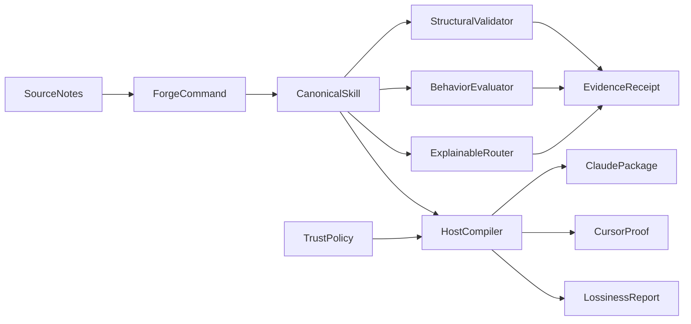

# Architecture

SkillsForge treats a skill as a **canonical capability unit**:

- `skills/<name>/SKILL.md` — portable Agent Skills surface
- `skills/<name>/skillsforge.json` — routing cases, declared capabilities, compatibility

Host packages under `dist/` are generated. They are never the source of truth.

## Modules

| Path | Responsibility |
|---|---|
| `core/skill-loader.mjs` | Load frontmatter + body + sidecar |
| `core/dependency-graph.mjs` | Requires DAG, cycles, missing, duplicates |
| `router/score.mjs` | Deterministic lexical scoring |
| `router/index.mjs` | Thresholded selection + explanation |
| `policy/scan-skill.mjs` | Capability scan vs declared sidecar |
| `scripts/validate-skill-lib.mjs` | Structural validation |
| `scripts/eval.mjs` | Frozen corpus runner |
| `scripts/build.mjs` | Validate → policy → compile → receipt |
| `adapters/claude-code.mjs` | Self-contained Claude plugin emit |
| `adapters/cursor.mjs` | Cursor export + field accounting |

## Design rules

1. Zero runtime npm dependencies.
2. No model calls on the critical path.
3. Generated files never become source of truth.
4. Unsupported host fields are recorded, never silently dropped.
5. Hooks invoke `node` explicitly for Windows safety.
