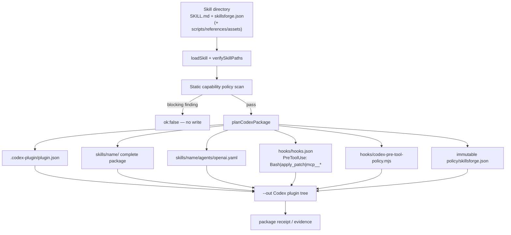
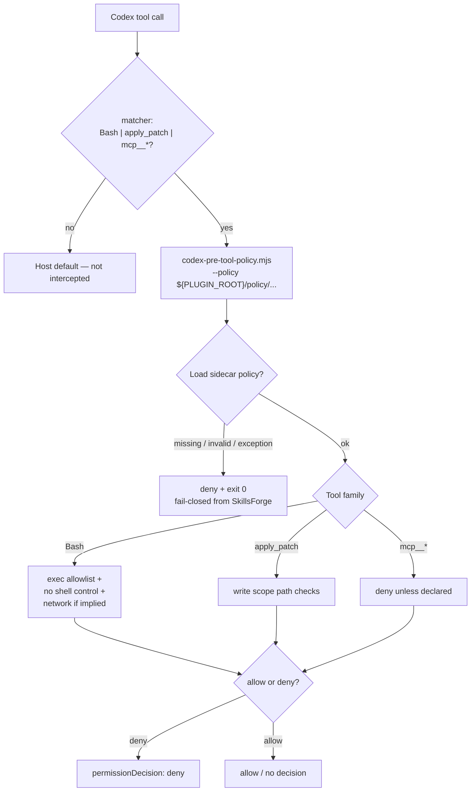
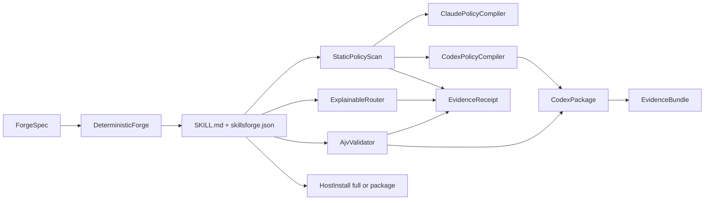
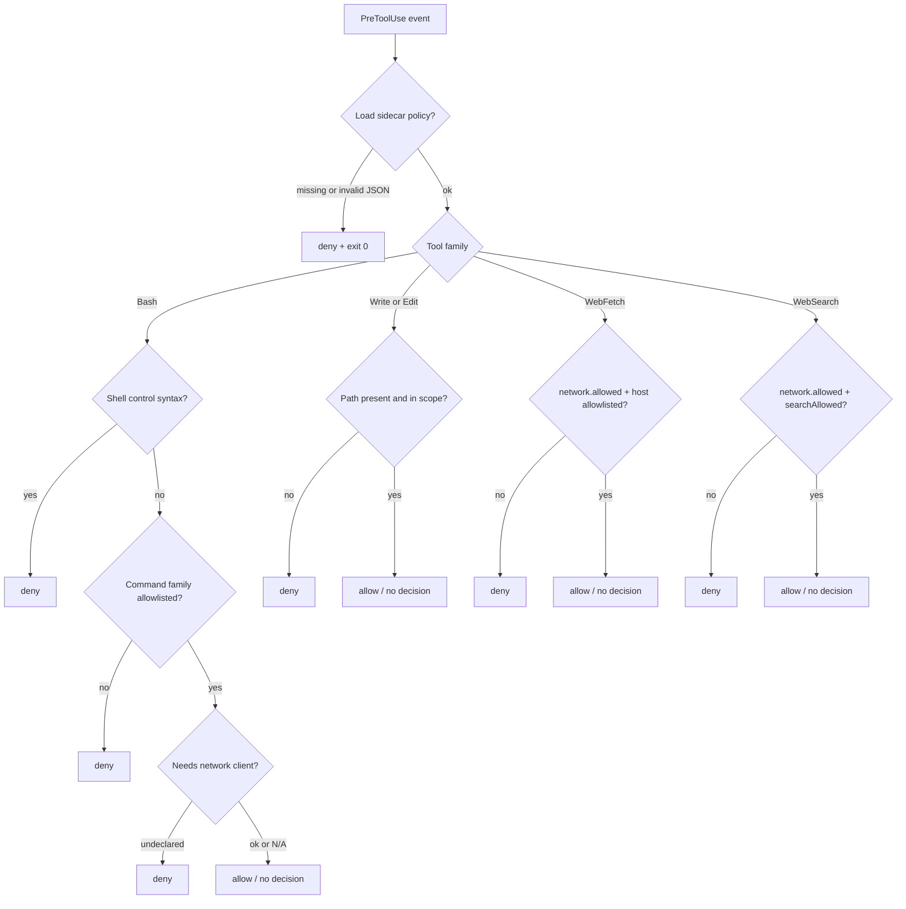
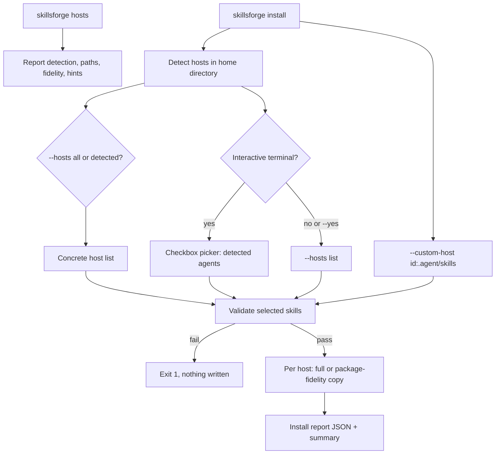

# SkillsForge architecture (v0.4)

SkillsForge is a **productivity Work OS** for portable Agent Skills (catalog, routing, workflows, library, operator terminals), with a **trust safety layer** underneath (validate, package, hooks, receipts). Canonical IR is `SKILL.md` + `skillsforge.json`. **Codex** is the primary native plugin target with guarded per-skill packaging and PreToolUse policy hooks. Claude Code remains the second full-fidelity host. Other AI CLIs receive package-fidelity installs unless they run equivalent hooks.

## Surfaces

| Surface | Role |
| --- | --- |
| Codex marketplace | `.agents/plugins/marketplace.json` → `plugins/skillsforge` |
| Codex plugin | `plugins/skillsforge/.codex-plugin/plugin.json` + skills + hooks |
| Claude marketplace | `.claude-plugin/marketplace.json` with `metadata.pluginRoot: ./plugins` |
| Claude plugin | `plugins/skillsforge/.claude-plugin/plugin.json` — commands, skills, hooks, agents, CLI |
| Canonical IR | `skillsforge.json` sidecar (Ajv Draft 2020-12) beside `SKILL.md` |
| Runtime CLI | `plugins/skillsforge/bin/skillsforge.mjs` (esbuild bundle) |
| Capability engine | `lib/capabilities/*` — loader, forge, router, policy, package, evidence, receipt, install |
| Codex compiler | `codex-package.mjs` + `codex-policy-compiler.mjs` — one skill → guarded plugin |
| Host inventory | `skillsforge hosts` lists known AI CLI targets, detection paths, fidelity, and install hints |
| Host installer | `skillsforge install` — full (Claude), package-fidelity (Codex/Cursor/OpenCode/ZCode/Hermes/Gemini), or custom package target |
| Workbench | `skillsforge wb` gives compact repo status, search, diff, recent commits, large files, and proof hints |
| Skill library | `skillsforge lib build|update|recommend` indexes repo and installed user skills; HTML/AI index are single-file; `lib serve` is localhost and read-only by default |
| Workflow catalog | `plugins/skillsforge/workflows/` contains 100 dry-run workflow definitions; `skillsforge workflows` lists, recommends, and previews them |
| Auto router | `skillsforge auto plan|run --read-only` combines installed-skill routing with workflow recommendations without writes |
| PowerShell helpers | `skillsforge ps export` writes local `sf-*.ps1` wrappers around token-friendly repo, library, workflow, and auto commands |
| Thin MCP | `scripts/skillsforge-mcp.mjs` exposes validate/route/skillshield plus read-only library/workflow recommendation |
| Distribution | `npm run build:dist` → `dist/claude-code`, `dist/codex`, `dist/cursor`, receipts |

## Canonical skill → Codex plugin compilation

Rules:

- Dry-run is default; `--write` mutates the filesystem.
- Multi-skill inputs are rejected — Codex hooks are plugin-level, so one capability policy per generated plugin.
- Validation or policy failure leaves `--out` unwritten.

## Codex hook trust flow

Host caveats (see [threat-model.md](threat-model.md)):

- Incomplete interception — tools outside the matcher are not guarded by SkillsForge.
- After installing or changing hooks, Codex may require `/hooks` trust review.
- If the host receives **invalid hook output**, behavior can fail open at the host even when SkillsForge intends fail-closed.

## Data flow (all hosts)

## Lazy-load contract

SkillsForge should stay usable with a large catalog:

1. `catalog` lists pack/profile/skill metadata only.
2. `route` narrows the task to one selected skill or a small candidate list.
3. The agent loads the selected `SKILL.md` only after routing or explicit user choice.
4. Bulk validators (`validate --all`, `skillshield --all`, build/evidence) may scan full skill bodies because those are deliberate verification commands.

Current implementation caches the loaded skill index by skills-root fingerprint. Next hardening step is a metadata-only route index so ordinary routing does not need every body in memory.

## Fail-closed Claude PreToolUse decision

## Host installer flow

## Host support

| Host | Status | Meaning |
| --- | --- | --- |
| Codex CLI | Native plugin + guarded package | Marketplace plugin; `package --host codex`; install copies complete packages to `~/.agents/skills` |
| Claude Code | Full | Marketplace, SessionStart, skill-scoped PreToolUse, CLI, receipts, eval |
| Cursor | Package fidelity | Complete skill directories; no runtime policy parity |
| OpenCode | Package fidelity | Complete skill directories; no runtime policy parity |
| ZCode-compatible local agent | Package fidelity | Complete skill directories; verify the configured local skills path |
| Hermes Agent | Package fidelity | Complete skill directories; no runtime policy parity |
| Gemini CLI | Package fidelity | Complete skill directories; no runtime policy parity |
| Custom host | Package fidelity | `--custom-host <id>:<skills-dir>` copies validated packages under user home |

## Runtime root resolution

The bundled CLI resolves:

1. Explicit `--root` / cwd repository (`plugins/skillsforge` present)
2. Installed plugin root (directory containing plugin manifest + `skills/`)
3. Module-adjacent plugin root when cache-copied

Cache-copy smoke tests copy **only** `plugins/skillsforge` and exercise doctor / validate / route / forge dry-run / enforce / receipt verify without repository `lib/` or `scripts/`.

## Trust boundaries

- Static policy scan is best-effort over text-like files (see [threat-model.md](threat-model.md)).
- PreToolUse hooks are guardrails honored by the host, not an OS sandbox.
- Receipts hash skill/plugin files + record evaluation denominators; they are **unsigned tamper evidence**, not certification.
- Codex plugin packaging refuses to write when validation or policy fails.

## Anti-goals

Not in scope for this product track:

- Swarms, AgentDB, Raft-style consensus, LSP integrations, or always-on monitors
- Token usage billing ledgers or cost accounting
- Domain expertise skill packs or multi-plugin “family” installs
- Multi-host runtime policy parity (package install ≠ Codex/Claude hooks)
- OS sandboxing or third-party attestation of safety
