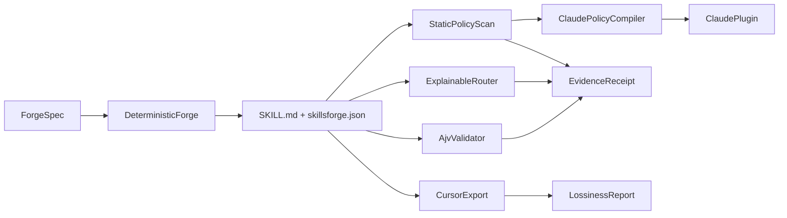

# SkillsForge architecture (v0.3)

SkillsForge is a Claude Code marketplace plugin that forges, validates, routes, policy-scans, and packages Agent Skills with reproducible evidence receipts.

## Surfaces

| Surface | Role |
| --- | --- |
| Marketplace | `.claude-plugin/marketplace.json` with `metadata.pluginRoot: ./plugins` |
| Plugin | `plugins/skillsforge/` — skills, hooks, agents, bundled CLI |
| Canonical IR | `skillsforge.json` sidecar (Ajv Draft 2020-12) beside `SKILL.md` |
| Runtime CLI | `plugins/skillsforge/bin/skillsforge.mjs` (esbuild bundle; no `npm install` on install) |
| Capability engine | `lib/capabilities/*` — loader, graph, forge, router, policy, receipt, doctor |
| Distribution | `npm run build:dist` → `dist/claude-code`, `dist/cursor`, trust receipt, lossiness |

## Data flow

## Host support

| Host | Status | Meaning |
| --- | --- | --- |
| Claude Code | Full | Marketplace install, SessionStart, skill-scoped PreToolUse, bundled CLI |
| Cursor | Proof | Deterministic SKILL.md export + lossiness report; no runtime policy parity |
| Codex / OpenCode | Unsupported | Not packaged or claimed |

## Runtime root resolution

The bundled CLI resolves:

1. Explicit `--root` / cwd repository (`plugins/skillsforge` present)
2. Installed plugin root (directory containing `.claude-plugin/plugin.json` + `skills/`)
3. Module-adjacent plugin root when cache-copied

Cache-copy smoke tests copy **only** `plugins/skillsforge` and exercise doctor / validate / route / forge dry-run / enforce / receipt verify without repository `lib/` or `scripts/`.

## Trust boundaries

- Static policy scan is best-effort over text-like files (see [threat-model.md](threat-model.md)).
- PreToolUse hooks are guardrails honored by the host, not an OS sandbox.
- Receipts hash skill files + record evaluation denominators; they are evidence, not certification.
- Release receipts hash packaged `dist/claude-code` bytes and embed `reportSha256` for the external routing-report. Verification recomputes package hashes and checks the report file; unsigned receipts are reproducible evidence, not third-party attestation.
