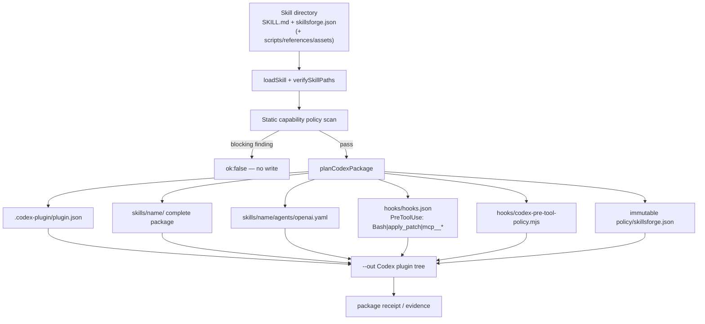
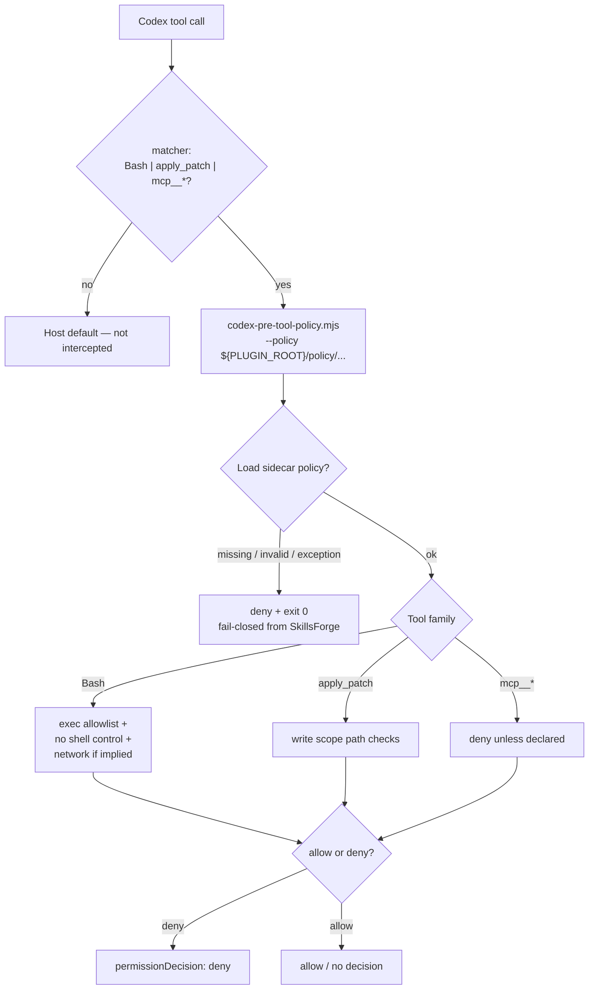
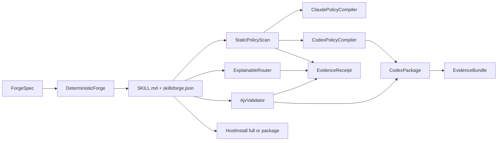
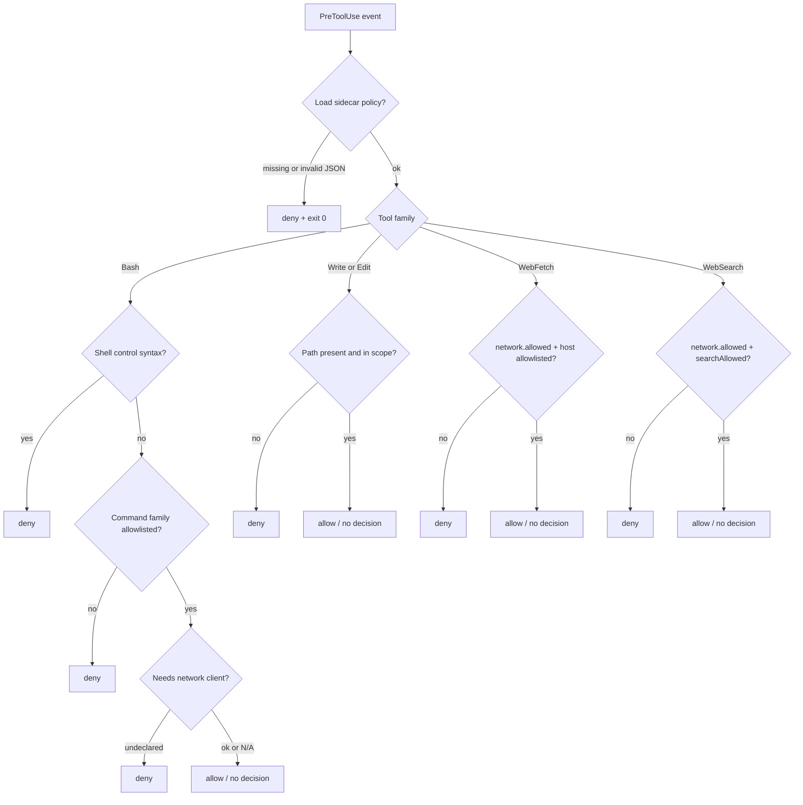
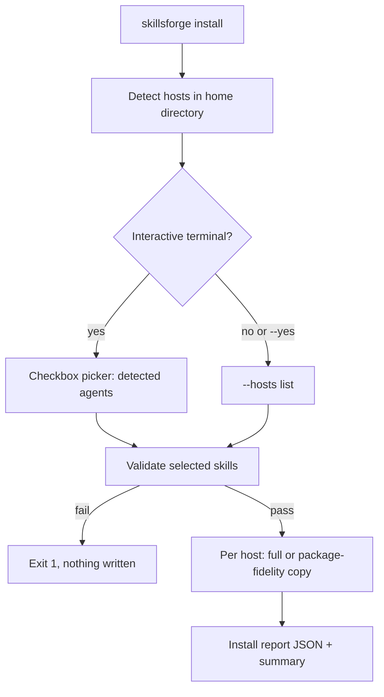

# SkillsForge architecture (v0.3)

SkillsForge is a capability / trust engine for portable Agent Skills. Canonical IR is `SKILL.md` + `skillsforge.json`. Claude Code remains a full marketplace host; **Codex** is a first-class native plugin target with guarded per-skill packaging and PreToolUse policy hooks.

## Surfaces

| Surface | Role |
| --- | --- |
| Codex marketplace | `.agents/plugins/marketplace.json` → `plugins/skillsforge` |
| Codex plugin | `plugins/skillsforge/.codex-plugin/plugin.json` + skills + hooks |
| Claude marketplace | `.claude-plugin/marketplace.json` with `metadata.pluginRoot: ./plugins` |
| Claude plugin | `plugins/skillsforge/.claude-plugin/plugin.json` — commands, skills, hooks, agents, CLI |
| Canonical IR | `skillsforge.json` sidecar (Ajv Draft 2020-12) beside `SKILL.md` |
| Runtime CLI | `plugins/skillsforge/bin/skillsforge.mjs` (esbuild bundle) |
| Capability engine | `lib/capabilities/*` — loader, forge, router, policy, package, evidence, receipt, install |
| Codex compiler | `codex-package.mjs` + `codex-policy-compiler.mjs` — one skill → guarded plugin |
| Host installer | `skillsforge install` — full (Claude) or package-fidelity (Cursor/Codex/OpenCode/Gemini) |
| Distribution | `npm run build:dist` → `dist/claude-code`, `dist/codex`, `dist/cursor`, receipts |

## Canonical skill → Codex plugin compilation

Rules:

- Dry-run is default; `--write` mutates the filesystem.
- Multi-skill inputs are rejected — Codex hooks are plugin-level, so one capability policy per generated plugin.
- Validation or policy failure leaves `--out` unwritten.

## Codex hook trust flow

Host caveats (see [threat-model.md](threat-model.md)):

- Incomplete interception — tools outside the matcher are not guarded by SkillsForge.
- After installing or changing hooks, Codex may require `/hooks` trust review.
- If the host receives **invalid hook output**, behavior can fail open at the host even when SkillsForge intends fail-closed.

## Data flow (all hosts)

## Fail-closed Claude PreToolUse decision

## Host installer flow

## Host support

| Host | Status | Meaning |
| --- | --- | --- |
| Codex CLI | Native plugin + guarded package | Marketplace plugin; `package --host codex`; install copies complete packages to `~/.agents/skills` |
| Claude Code | Full | Marketplace, SessionStart, skill-scoped PreToolUse, CLI, receipts, eval |
| Cursor | Package fidelity | Complete skill directories; no runtime policy parity |
| OpenCode | Package fidelity | Complete skill directories; no runtime policy parity |
| Gemini CLI | Package fidelity | Complete skill directories; no runtime policy parity |

## Runtime root resolution

The bundled CLI resolves:

1. Explicit `--root` / cwd repository (`plugins/skillsforge` present)
2. Installed plugin root (directory containing plugin manifest + `skills/`)
3. Module-adjacent plugin root when cache-copied

Cache-copy smoke tests copy **only** `plugins/skillsforge` and exercise doctor / validate / route / forge dry-run / enforce / receipt verify without repository `lib/` or `scripts/`.

## Trust boundaries

- Static policy scan is best-effort over text-like files (see [threat-model.md](threat-model.md)).
- PreToolUse hooks are guardrails honored by the host, not an OS sandbox.
- Receipts hash skill/plugin files + record evaluation denominators; they are **unsigned tamper evidence**, not certification.
- Codex plugin packaging refuses to write when validation or policy fails.

## Anti-goals

Not in scope for this product track:

- MCP servers, LSP integrations, or always-on monitors
- Token / usage ledgers or cost accounting
- Domain expertise skill packs or multi-plugin “family” installs
- Multi-host runtime policy parity (package install ≠ Codex/Claude hooks)
- OS sandboxing or third-party attestation of safety
