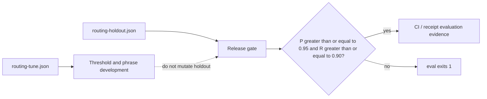

# Evaluation method (v0.3)

SkillsForge routing quality is measured against frozen corpora under `evaluation/`.

## Corpora

| Set | Path | Purpose |
| --- | --- | --- |
| Tune | `evaluation/routing-tune.json` | Threshold / phrase development |
| Holdout | `evaluation/routing-holdout.json` | Untouched release gate |

Holdout must not be edited to inflate scores without a version bump and changelog note.



## Metrics

Each case declares an expected skill name or `null` (no skill).

Confusion counts use honest one-vs-rest accounting (`scripts/eval.mjs`):

- **TP** — selected skill matches expected non-null
- **TN** — correctly selected null
- **FP only** — selected a skill when expected was `null`
- **FN only** — selected null when a skill was expected
- **FP + FN** — wrong non-null selection (expected A, got B): counts as one false positive for B and one false negative for A

Because wrong-skill cases increment both FP and FN, `tp + fp + fn + tn` may exceed `total`.

Derived:

- Precision = TP / (TP + FP)
- Recall = TP / (TP + FN)
- **Exact-match accuracy** — fraction of cases where selected label equals expected (reported separately; not the release gate)

Also reported: latency p50/p95, failure list, corpus SHA-256, frozen date.

## Baselines

Eval compares:

1. **Full sidecar router** — contiguous phrase triggers, anti-triggers, maturity, description overlap; selection requires positive trigger evidence and a minimum score margin over #2
2. **Metadata-only baseline** — description tokens only (no sidecar routing); cannot select without trigger evidence

Release gate (holdout): precision ≥ 0.95 and recall ≥ 0.90.

## Running

```sh
npm run eval
```

Writes `artifacts/evaluation/routing-report.json` with raw denominators, exact-match accuracy, and failures. CI uploads this artifact from the release-contract job.

## Honesty limits

- Scores reflect this corpus, not production traffic.
- Perfect scores on tiny co-tuned sets are rejected; holdout includes paraphrases, collisions, and out-of-domain negatives.
- Failures are listed in the report (not dropped).
- Holdout case labels/queries must not be mutated to pass the gate.
